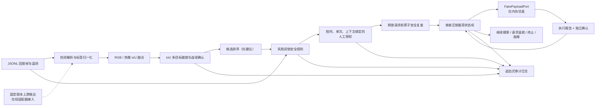
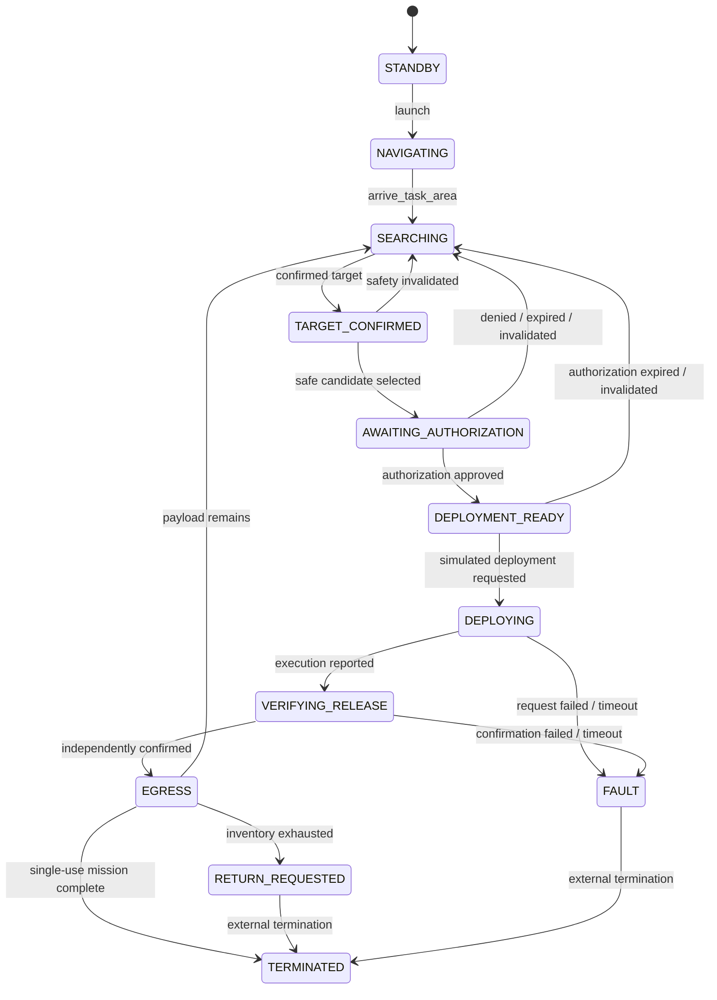

# Multi-Detect

Multi-Detect 是一个面向**非危险、非攻击性任务载荷**的安全优先任务编排原型。它验证的重点不是“检测到目标就投放”，而是把感知候选、多目标跟踪、安全规则、人工授权、载荷互锁、双重释放确认和审计串成一个可重复测试的软件回放闭环。

> **重要边界：本项目仅供 simulation-only 回放和软件测试。**
>
> 仓库现已支持本机/RTSP 摄像头、ONNX Nx6 推理以及 Pixhawk MAVLink **只读**遥测；仍然没有真实飞控命令、航路规划、模式切换、任务上传、GPIO/CAN/串口执行器或物理载荷释放接口。`MissionController` 只接受内存中的 `FakePayloadPort`；CLI 中的“发射”和“抵达任务区”只是状态迁移，不代表无人机实际起飞或自主导航。请勿将本原型连接到真实释放机构。

G20、GR01、网口三体摄像头、Jetson 与 Pixhawk V6X 的推荐接线、触摸框选协议、
本地视频叠加 UI 和安全载荷部署边界见
[`docs/g20-gr01-integration.md`](docs/g20-gr01-integration.md)。

当前示例聚焦火灾场景，但任务配置也表达救援物资、通信中继、环境/工业传感器、农业载荷和多点小包裹等非危险任务。配置层支持这些任务类型，不代表它们已经完成模型训练、硬件集成或现场验证。

同一架飞机现在可以使用两种构型：`payloads: []` 表示未挂载、只巡检告警；配置一个或多个白名单载荷舱时，只表达期望构型。实时部署还必须由独立只读载荷清单确认模块身份、舱位、类型、锁定和存在传感器，未知或不匹配时可以继续巡检，但不能进入授权流程。分阶段实现与验收标准见 [实施路线图](docs/implementation-roadmap.md)。

准备ONNX、Jetson、RTSP、Pixhawk和载荷HIL资料时，按 [集成输入清单](docs/integration-input-checklist.md) 分批提供即可；不要把摄像头密码、HMAC密钥或私钥提交到仓库。

## 已实现的软件回放闭环



已经实现的能力包括：

- 严格任务配置校验：人工授权在 MVP 中不可关闭；任务类型和非危险载荷使用白名单约束。
- 上游 Darknet `(label, confidence, (cx, cy, w, h))` 与旧 YOLOv5 `N x 6` 输出适配，归一化为统一 `Detection`；上游 `fire` 映射为项目规范标签 `flame`。
- RGB/热像一对一 IoU 佐证、多目标 IoU 跟踪，以及按最少帧数、持续时间、置信度和最大帧间隔确认目标。
- 候选排序与安全判定分离；排序不能授权或触发载荷事务。
- 对遥测新鲜度、允许区域、围栏、定位、链路、飞行模式、释放区、高度、姿态、速度、人员检测器健康、人员排除区和当前帧热像一致性进行失败闭锁检查；未知或失效证据会拒绝部署。
- 授权挑战绑定任务、目标及其 revision、载荷舱、场景摘要、规则版本和有效期；授权只能消费一次。
- 等待授权或已进入 `DEPLOYMENT_READY` 时会持续处理新场景帧：同一轨迹且规则语义等价时，保持 challenge ID、nonce 和原到期时间不变，仅把绑定刷新到最新 revision/场景摘要；出现人员、规则否决、目标断裂或明显空间变化时，旧授权失效并重新闭锁已进入 `ARMED` 的舱位。
- 已确认服务的图像区域在配置的冷却期内会抑制重新分配，即使短时跟踪 ID 因间隔过长而重建；生产系统仍需用地理坐标和持久化目标身份替代这一回放级指纹。
- 独立编号舱位、单舱互锁、幂等 `release_id`、超时进入故障且不自动重试。
- `RELEASED` 不等于成功；只有模拟执行报告与独立来源确认同时存在时，才进入 `RELEASE_CONFIRMED`。
- 线程安全内存审计日志，以及 UTF-8 原子 JSONL 导出。
- 告警支持SQLite持久化发件箱、HMAC-SHA256 UDP、关联ACK、有限重试、指数退避和接收端去重；真实数传电台仍需按 [告警数传说明](docs/data-link-alerts.md) 在选定链路上验证。

## 状态机

任务主路径如下；拒绝、过期、目标丢失或安全证据变化会返回搜索，执行阶段的异常和不确定结果会进入 `FAULT`：



载荷舱严格按以下状态推进：

```text
LOCKED -> ARMED -> RELEASE_REQUESTED -> RELEASED -> RELEASE_CONFIRMED
                         \-------------------------------> FAILED
```

这里的 **`ARMED` 仅表示任务载荷系统在有效人工授权和安全约束下进入“可接受释放请求”的状态，与武器无关**。本仓库中的该状态最终也只能连接 `FakePayloadPort`，不会驱动物理装置。

## 安装

要求 Python 3.11 或更高版本。Windows PowerShell：

```powershell
py -m venv .venv
.venv\Scripts\Activate.ps1
python -m pip install --upgrade pip
python -m pip install -e ".[dev]"
```

安装后会提供 `multi-detect` 命令。也可在已激活环境中使用 `python -m multidetect`，参数完全相同。

## 使用 CLI

CLI 每行输出一个 JSON 对象，所有输出都带有或继承 `simulation_only` 语义。

### 0. 巡检构型：零载荷火情告警

同一平台可以使用零载荷配置运行巡检任务。确认火情后生成一次去重告警，继续搜索；不会创建授权挑战，也不会访问载荷端口：

```powershell
multi-detect validate-config configs/missions/fire_patrol.demo.json
multi-detect replay configs/missions/fire_patrol.demo.json examples/fire_mission_replay.jsonl
```

回放会输出 `fire_alert_confirmed`，最终保持 `phase=searching`、`payload_installed=false`、`fake_release_request_count=0`。`--simulate-authorized-cycle` 不能与零载荷配置一起使用。

拿到后NMS ONNX模型后，先验证制品哈希、`Nx6` 输出契约、实际Provider和合成推理延迟：

```powershell
multi-detect model-check --onnx-model models/fire-smoke-nms.onnx --model-manifest models/fire-smoke-nms.manifest.json --class-names fire,smoke --output-coordinates normalized_xyxy
```

模型清单绑定实际制品SHA-256、模型版本、类别顺序、用途限制和批准状态；生产门禁增加 `--require-production-approved`。这仍不会验证模型准确率；准确率需要使用火灾、无火、烟雾、夕阳和反光等部署域数据集评估。

火烟模型清单角色为 `fire_candidate`；人员/消防员模型必须单独声明
`safety_object_evidence`。运行时会拒绝把火烟清单当作人员安全证据，安全对象模型本身
也不能直接确认净空或授权部署。仅覆盖 `person` 类名但没有通过角色清单验证时，检测
结果可以用于诊断显示，但 `person_detector_healthy` 保持 false，载荷流程失败闭锁。

### 固定翼投放窗口软件 HIL

固定翼构型不能沿用悬停平台接近零地速的安全条件。示例配置
`configs/missions/fire_suppression_fixed_wing.demo.json` 增加了最小/最大地速门限，以及
固定摄像头视场角、安装下视角和软件 HIL 下降时间模型。可用以下命令单独检查目标框
当前处于窗口之前、窗口内还是已经越过窗口：

```powershell
multi-detect release-window-check `
  configs/missions/fire_suppression_fixed_wing.demo.json `
  --x1 0.45 --y1 0.40 --x2 0.55 --y2 0.50 `
  --altitude-agl-m 40 --ground-speed-mps 18 --pitch-deg 0 --now-s 100
```

完整的软件 HIL 可继续运行固定翼回放。它必须先产生人工授权挑战，随后才允许测试操作员
完成一次 `FakePayloadPort` 事务：

```powershell
multi-detect replay `
  configs/missions/fire_suppression_fixed_wing.demo.json `
  examples/fire_fixed_wing_hil_replay.jsonl `
  --simulate-authorized-cycle --operator-id fixed-wing-hil-operator
```

输出包含相对方位、估算地面距离、横向偏差、载荷下降时间、投放提前距离和纵向窗口
误差。该计算采用静风点质量近似，未包含风、地形、实测载荷气动和飞机响应；因此始终
标记为 `advisory_only=true`、`flight_control_enabled=false`、
`physical_release_enabled=false`。命令本身不运行完整安全规则、不创建人工授权，也不
访问载荷端口。配置了该窗口的任务只有在完整状态机同时满足窗口、安全证据、载荷清单
和人工授权后，才可能进入 `FakePayloadPort` 软件仿真。

不运行模型训练或推理时，可用一条命令回归巡检、固定翼授权 HIL 和人员否决三条路径：

```powershell
python scripts/run_software_acceptance.py `
  --out artifacts/evaluation/software-acceptance.json
```

独立载荷控制器的软件链路也可运行真实 localhost UDP/HMAC 回环。该命令完整经过固定翼
安全规则和人工授权，但控制器只模拟惰性执行，`EXECUTED` 后仍要求使用另一把 HMAC 密钥、
不同 sensor ID 的第二路独立确认：

```powershell
.\.venv\Scripts\python.exe scripts\payload_mission_hil_loopback_demo.py
```

成功输出必须声明 `command_messages_sent=0`、`flight_control_enabled=false` 和
`physical_release_enabled=false`，并包含 `independent_confirmation_authenticated=true` 与
`controller_and_sensor_id_separated=true`。拒绝、超时或矛盾反馈全部进入闭锁故障，不会
自动重试。独立传感器确认使用另一个只接收证据的 UDP 通道，Jetson 不经该通道发送任何
执行命令。

实时摄像头运行器也支持显式注入这一双通道周期，但必须同时使用
`--simulate-payload-cycle --inert-payload-hil`，并从环境变量提供三把不同密钥。当前 CLI
只允许 localhost 拆桨 HIL；默认不开启，Jetson 生产巡检服务模板也不包含这些参数。完整
参数见 [实时摄像头与 Jetson 说明](docs/live-camera-jetson.md)。加入
`--auto-simulate-payload-cycle` 后，G20 有效授权可自动启动同一个双通道惰性周期；缺少
授权或任一安全条件时仍为零请求。

验收器要求巡检模式只产生一次告警且零授权/零释放请求；载荷模式必须先出现
`READY` 建议窗口和人工挑战，再完成恰好一次假端口事务；同样的窗口内加入人员框后
必须零授权、零释放请求。输出始终声明模型训练、模型推理、飞控和物理释放均未执行。

没有真实模型时，可生成一份**恒定输出、仅用于接口HIL**的 Nx6 ONNX，验证真实
ONNX Runtime、摄像头、跟踪、告警和逐帧日志。它对每一帧都输出同一个 `flame` 框，
不能用于任何火灾判断：

```powershell
python -m pip install -e ".[model-tools]"
multi-detect synthetic-model-init --out-dir artifacts/synthetic-hil
multi-detect live-camera configs/missions/fire_patrol.demo.json `
  --source 0 `
  --onnx-model artifacts/synthetic-hil/synthetic-fire-nx6-hil.onnx `
  --model-manifest artifacts/synthetic-hil/synthetic-fire-nx6-hil.manifest.json `
  --class-names fire,smoke --output-coordinates normalized_xyxy `
  --allow-synthetic-hil-model --max-frames 120 --no-display
```

`live-camera` 必须显式提供 `--allow-synthetic-hil-model` 才会接受该清单；生产批准门禁
永远拒绝它，Jetson systemd 服务也不包含这个开关。

该路径已经与独立地面 `alert-udp-receiver` 进程完成本机回环：告警只有在收到关联签名
ACK后才从飞端SQLite outbox标记为 `delivered`，地面SQLite按同一 `alert_id` 持久去重。
命令与密钥处理见 [告警数传说明](docs/data-link-alerts.md)。

### 1. 校验任务配置

```powershell
multi-detect validate-config configs/missions/fire_suppression.demo.json
```

成功时输出 `config_valid`；非法载荷、禁用人工授权、重复舱位或不合理安全阈值会使命令以非零状态退出。

未挂载巡检构型：

```powershell
multi-detect validate-config configs/missions/fire_patrol.demo.json
multi-detect replay configs/missions/fire_patrol.demo.json examples/fire_mission_replay.jsonl
```

确认火情后会输出 `fire_alert` 数据，不创建授权挑战、不调用仿真释放端口，并继续保持搜索状态。

### 2. 默认回放：停在人工授权

```powershell
multi-detect replay configs/missions/fire_suppression.demo.json examples/fire_mission_replay.jsonl
```

默认行为会解析四帧示例、完成融合/跟踪/安全判定并创建授权挑战，然后停在 `AWAITING_AUTHORIZATION`。CLI 只输出已脱敏挑战，包含 `nonce_redacted: true`，不会输出 nonce，也不会向 `FakePayloadPort` 提交请求。

如需把这一“等待授权”的运行写入审计文件：

```powershell
multi-detect replay configs/missions/fire_suppression.demo.json examples/fire_mission_replay.jsonl --audit-out artifacts/pending-authorization.audit.jsonl
```

### 3. 显式完成一次授权仿真周期

只有显式提供 `--simulate-authorized-cycle` 时，CLI 才会充当演示操作者，消费挑战并完成**一次** FakePayloadPort 事务：

```powershell
multi-detect replay configs/missions/fire_suppression.demo.json examples/fire_mission_replay.jsonl --simulate-authorized-cycle --operator-id demo-operator --audit-out artifacts/authorized-cycle.audit.jsonl
```

该命令仍然不会控制硬件。它只依次模拟授权、舱位进入 `ARMED`、安全复查、释放请求、执行报告、独立舱位传感器确认和审计导出；完成一个周期后 CLI 即停止，不会自动处理所有剩余载荷。

一次性平台使用单舱位与 `terminate_after_first` 完成策略。以下命令在模拟释放获得双重确认后进入 `TERMINATED`：

```powershell
multi-detect replay configs/missions/fire_suppression_disposable.demo.json examples/fire_mission_replay.jsonl --simulate-authorized-cycle --audit-out artifacts/disposable-authorized-cycle.audit.jsonl
```

## 上游火烟检测基线

本项目审计并固定引用：

- 仓库：<https://github.com/gengyanlei/fire-smoke-detect-yolov4>
- Commit：[`98b1fec0f82e09d67ef5fc657a80eaf0b1450360`](https://github.com/gengyanlei/fire-smoke-detect-yolov4/tree/98b1fec0f82e09d67ef5fc657a80eaf0b1450360)

上游只通过 `src/multidetect/adapters/fire_smoke_legacy.py` 的输出适配器接入，未复制其源码、二进制、数据集或权重，原因是：

- 上游维护者已说明代码停止更新，运行环境停留在旧 Python、CUDA、Darknet/PyTorch 版本。
- 旧 `best.pt` 是可执行式 PyTorch pickle，不应在开发机、CI 或飞行硬件上直接加载。
- 数据与派生权重的使用权、YOLOv5 派生代码许可仍需法律和来源审查。
- 上游仅提供火/烟视觉候选，不包含跟踪、热像融合、人员排除、飞控、安全规则、人工授权、载荷互锁或释放确认。

因此适配器只负责坐标、置信度、类别和元数据规范化，绝不负责授权、优先级、安全许可或载荷动作。详细审计见 [docs/upstream-baseline.md](docs/upstream-baseline.md) 和 [third_party/fire_smoke_legacy/README.md](third_party/fire_smoke_legacy/README.md)。

## 实时摄像头、RTSP、Jetson 与 Pixhawk

新增 `camera-check` 和 `live-camera` CLI：摄像头/RTSP → OpenCV → 严格 post-NMS `N×6` ONNX 输出 → 现有适配器 → 跟踪/规则。显示端保持为单一摄像头画面，只叠加检测框、跟踪框、火情告警和少量状态文字；鼠标左键拖拽可框选或切换目标，右键或 `X` 取消锁定，`Q` 退出。框选只建立跟踪关系，不能授权或触发物理载荷。火情告警携带的是飞机发现目标时的位置，不冒充未经相机标定和地形求交计算的火点坐标。Pixhawk 仅读取遥测，且未知的围栏、模式和投放区条件会保持拒绝。完整命令、Jetson Orin Nano provider 优先级和 V6X 接线/验证边界见 [实时部署说明](docs/live-camera-jetson.md)。

真实巡航可启用 `--observe-pixhawk-lifecycle`：只有观察到健康链路/定位、已解锁、允许的自动模式和指定任务序号后才进入搜索；该模式不发送任何飞控消息。

载荷构型可选接入独立签名的区域安全文件 HIL。报告必须通过 HMAC，并绑定任务 ID、
Pixhawk 新鲜位置、时间戳和单调序号；任何异常都会把允许区域、围栏健康和投放区净空恢复为
未知，继续禁止授权。该桥接仍为只读验证，不增加飞控或实体投放接口，详见
[实时部署说明](docs/live-camera-jetson.md#独立区域安全证据仅文件型-hil)。

连接V6X后可先独立执行 `multi-detect pixhawk-check --endpoint <串口或UDP端点> --require-fresh-link`，无需摄像头和模型。该诊断只接收遥测，输出中固定声明发送消息数为零。

带载荷的软件/HIL演示可显式启用 `--simulate-payload-cycle`，授权后按 `S` 完成一次
`FakePayloadPort` 仿真反馈闭环。无人值守软件验收还可同时显式增加
`--auto-simulate-payload-cycle`，在有效授权进入 `DEPLOYMENT_READY` 后自动执行一次仿真或
认证惰性 HIL 周期。自动开关不能单独使用，不会绕过安全规则/授权，也没有物理执行器
路径；零载荷巡检配置会拒绝使用。

载荷模块接入前可使用只读库存报告检查协议版本、模块身份、舱位类型、机械锁、总互锁和独立存在传感器；实时模式在没有可信载荷控制器证据时保持拒绝：

```powershell
multi-detect payload-inventory-check configs/missions/fire_suppression.demo.json examples/payload_inventory.demo.json --now-s 1000.5
```

部署域模型评估采用逐帧预测日志和严格帧ID对齐的标注数据：

```powershell
multi-detect evaluate-detections examples/evaluation_ground_truth.demo.jsonl examples/evaluation_predictions.demo.jsonl
```

该命令计算逐类别/总体精确率、召回率、误报、漏报和推理延迟；示例文件仅用于验证评估程序。

G20 到 Jetson 的触摸框选链路可在没有无线电和飞控时运行完整回环。演示会依次模拟
首个选择包丢失、首个 ACK 丢失、相同命令幂等重传，以及跟踪/任务状态返回；应用载荷和外层
MAVLink2 `TUNNEL` 都经过认证，且不包含飞控写入或载荷控制：

```powershell
multi-detect operator-link-demo
```

实时运行时，Jetson 还会向已建立的操作员会话发送独立的 89 字节只读任务状态包和
86 字节安全规则状态包，供 G20 显示任务阶段、总体安全结论、逐规则
`PASS/DENY/UNKNOWN`、授权显示态、载荷计数和固定翼 `WAIT/READY` 建议窗口。两个消息
都没有授权、飞控或物理释放入口。另有独立的 105/115/50 字节授权 challenge、决定和
ACK 契约：nonce 不离开 Jetson，决定必须绑定已发布快照并经双层认证；Jetson 应用决定
时再次检查当前任务安全状态，成功也只进入 `DEPLOYMENT_READY`，不会直接请求释放。

交换机/GR01 上电后，可在 Jetson 运行只接受框选元数据的 UDP 诊断服务，在 G20 或
同网段电脑运行选择客户端。两个密钥只从环境变量读取，命令不会回显密钥：

```powershell
multi-detect operator-udp-server --bind-host 0.0.0.0 --port 14580 `
  --operator-hmac-key-env MULTIDETECT_OPERATOR_KEY `
  --mavlink-signing-key-hex-env MULTIDETECT_MAVLINK_KEY_HEX

multi-detect operator-udp-select --host <JETSON_IP> --port 14580 `
  --operator-hmac-key-env MULTIDETECT_OPERATOR_KEY `
  --mavlink-signing-key-hex-env MULTIDETECT_MAVLINK_KEY_HEX
```

这两个命令没有任务上传、模式切换、飞控命令或载荷接口，仅用于确认 GR01 双向 IP、
签名 MAVLink2、框选校验和 ACK 延迟。

授权元数据可用显式协议 HIL 模式做第二阶段台架回环。Jetson 端必须额外声明
`--authorization-hil` 并接收至少两个数据报；G20 端默认 `deny`，测试批准时必须明确写
`--decision approve`：

```powershell
multi-detect operator-udp-server --bind-host 0.0.0.0 --port 14580 `
  --operator-hmac-key-env MULTIDETECT_OPERATOR_KEY `
  --mavlink-signing-key-hex-env MULTIDETECT_MAVLINK_KEY_HEX `
  --authorization-hil --max-datagrams 2

multi-detect operator-udp-authorize --host <JETSON_IP> --port 14580 `
  --operator-hmac-key-env MULTIDETECT_OPERATOR_KEY `
  --mavlink-signing-key-hex-env MULTIDETECT_MAVLINK_KEY_HEX `
  --operator-id <BENCH_OPERATOR_ID> --decision approve
```

这里的 challenge 是诊断端生成的合成协议数据，不连接任务控制器；成功 ACK 固定声明
`mission_state_changed=false`、`payload_release_requested=false`。实时任务中的同一协议由
`LiveOperatorBridge` 接入，批准后也只进入 `DEPLOYMENT_READY`。

## 目录

```text
Multi-Detect/
├─ configs/
│  ├─ missions/              # 示例任务 JSON
│  └─ schemas/               # 任务 JSON Schema
├─ docs/                      # 架构、安全边界和上游审计
├─ examples/                  # 严格有序的 JSONL 回放帧
├─ models/                    # 模型制品规范；不存放生产权重
├─ src/multidetect/
│  ├─ adapters/               # 旧 Darknet / YOLOv5 输出适配
│  ├─ alerts.py                # 告警信封、认证UDP/ACK与SQLite发件箱
│  ├─ evaluation.py            # 逐帧预测日志与精确率/召回率离线评估
│  ├─ model_manifest.py        # 模型哈希、类别、坐标契约与批准门禁
│  ├─ operator_link.py         # G20框选与Jetson跟踪状态领域模型
│  ├─ operator_protocol.py     # 128字节TUNNEL应用帧、HMAC与量化编解码
│  ├─ operator_transport.py    # 有界ACK重试、幂等与冲突检测
│  ├─ operator_mavlink.py      # 签名MAVLink2 TUNNEL封装与身份校验
│  ├─ operator_udp.py          # GR01直连IP的安全框选/ACK诊断端点
│  ├─ operator_protocol.py      # G20紧凑签名消息与TUNNEL载荷契约
│  ├─ operator_transport.py     # 框选命令有限重试、幂等ACK与冲突拒绝
│  ├─ operator_mavlink.py       # 定向MAVLink2 TUNNEL字节帧适配（无I/O）
│  ├─ perception.py           # RGB/热像融合
│  ├─ tracking.py             # IoU 多目标跟踪与确认
│  ├─ ranking.py              # 只读候选排序
│  ├─ safety.py               # 失败闭锁规则
│  ├─ authorization.py        # 短时、单次、上下文绑定授权
│  ├─ payload.py              # FakePayloadPort 与舱位互锁
│  ├─ payload_hil_mission.py  # 授权任务到惰性控制器的失败闭锁 HIL 适配器
│  ├─ payload_confirmation_hil.py # 独立舱位传感器认证与防重放确认
│  ├─ payload_confirmation_udp.py # 独立确认只读 UDP HIL 通道
│  ├─ payload_inventory.py    # 只读载荷清单、HMAC/序号验证与失败闭锁
│  ├─ state_machine.py        # 任务状态机
│  ├─ mission.py              # 软件闭环编排
│  ├─ audit.py                # 有界内存、持续落盘与原子 JSONL 审计
│  ├─ replay.py               # 回放输入解析和顺序校验
│  ├─ vision.py               # OpenCV 采集与 ONNX post-NMS Nx6 推理
│  ├─ live.py                 # 本地授权界面与实时感知编排
│  ├─ telemetry.py            # 失败闭锁与遥测 provider 抽象
│  ├─ pixhawk.py              # Pixhawk MAVLink 只读遥测适配
│  └─ cli.py                  # 配置、回放、摄像头、模型、评估与只读硬件诊断入口
├─ tests/                     # 单元、故障与端到端回放测试
└─ third_party/               # 上游来源记录；不含上游制品
```

## 测试

```powershell
python -m pytest
python -m ruff check .
```

测试覆盖配置边界、坐标适配、融合、跟踪、排序、安全拒绝、授权绑定与并发消费、载荷互锁/幂等/反馈顺序、状态机、审计原子写入、签名 MAVLink2 框选链路、CLI 和完整 FakePayloadPort 回放闭环。这些是软件测试，不是飞行测试、SIL/HIL 认证或安全适航证据。

## 尚未实现

- 真实无人机发射、起降、航路规划、避障、返航和任何飞控/执行器写入。
- 生产级 Jetson 模型制品、热像同步、实时性能/功耗/热预算与部署域验证。
- RGB/热像硬件时间同步、内外参标定和现场热学验证。
- 真实人员/消防员/车辆/建筑/电力线/危险设施模型及部署域数据验证。
- 物理载荷舱、GPIO/CAN/串口协议、执行器、电气互锁和真实反馈传感器。
- 生产级操作者身份系统、角色权限、多人复核和经过确认的远程数传协议；当前只有本地操作界面。
- 完整任务事务数据库、授权断电恢复和远程审计存储；火情告警已有可选 SQLite outbox，但远端确认和有界退避仍未实现。
- 多机协调、现场通信中继、地图服务、动态禁飞区和法规数据源。

## 任何生产或现场集成前

- 完成任务级危险分析、安全论证、当地航空/应急法规审批和明确的非危险载荷批准清单。
- 取得数据、代码和模型的清晰权利；建立模型卡、数据版本、制品哈希、签名和可复现实验记录。
- 在真实部署域测量逐类别精确率/召回率、置信度校准、误报/漏报、遮挡、烟雾、昼夜和极端天气表现。
- 建立经校准且有完整性/新鲜度监控的飞控、围栏、定位、链路、相机与热像数据源。
- 设计经过认证的物理互锁和认证、确认、版本化、抗重放的设备协议；不允许感知模型直接调用执行器。
- 使用独立硬件证据确认释放；仅凭视觉结果不得判定 `RELEASE_CONFIRMED`。
- 为断电、重启、丢包、乱序、重复反馈、卡舱和不确定释放建立持久化恢复策略；不确定状态不得自动重试。
- 完成场景回放、故障注入、软件在环、硬件在环、环境、EMC、人因和受控现场测试。
- 对真实飞控/载荷端口进行新的设计评审；当前 `PayloadController` 故意只接受 `FakePayloadPort`，不能把真实驱动“直接替换进去”。

更多设计依据见 [架构说明](docs/architecture.md) 与 [MVP 安全边界](docs/safety-case.md)。

Jetson目标机的无特权systemd模板、受限环境文件和部署前检查见 [Jetson部署模板](deploy/jetson/README.md)；接入所需模型、RTSP、Jetson、Pixhawk、数传和载荷控制器资料见 [集成输入清单](docs/integration-input-checklist.md)。
