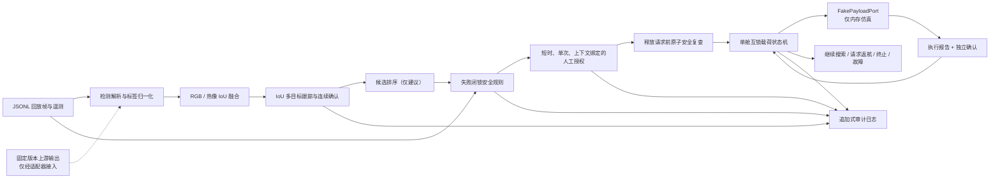
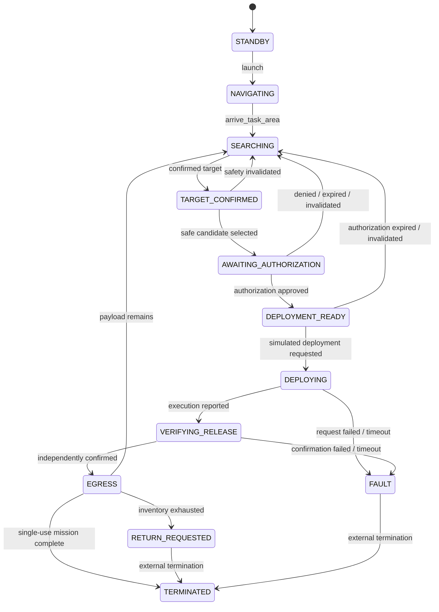

# Multi-Detect

Multi-Detect 是一个面向**非危险、非攻击性任务载荷**的安全优先任务编排原型。它验证的重点不是“检测到目标就投放”，而是把感知候选、多目标跟踪、安全规则、人工授权、载荷互锁、双重释放确认和审计串成一个可重复测试的软件回放闭环。

> **重要边界：本项目仅供 simulation-only 回放和软件测试。**
>
> 仓库没有真实飞控、航路规划、MAVLink/PX4/ArduPilot 接口、相机采集、GPIO/CAN/串口驱动或物理载荷执行器。`MissionController` 只接受内存中的 `FakePayloadPort`；CLI 中的“发射”和“抵达任务区”只是状态迁移，不代表无人机实际起飞或自主导航。请勿将本原型连接到真实释放机构。

当前示例聚焦火灾场景，但任务配置也表达救援物资、通信中继、环境/工业传感器、农业载荷和多点小包裹等非危险任务。配置层支持这些任务类型，不代表它们已经完成模型训练、硬件集成或现场验证。

## 已实现的软件回放闭环



已经实现的能力包括：

- 严格任务配置校验：人工授权在 MVP 中不可关闭；任务类型和非危险载荷使用白名单约束。
- 上游 Darknet `(label, confidence, (cx, cy, w, h))` 与旧 YOLOv5 `N x 6` 输出适配，归一化为统一 `Detection`；上游 `fire` 映射为项目规范标签 `flame`。
- RGB/热像一对一 IoU 佐证、多目标 IoU 跟踪，以及按最少帧数、持续时间、置信度和最大帧间隔确认目标。
- 候选排序与安全判定分离；排序不能授权或触发载荷事务。
- 对遥测新鲜度、允许区域、围栏、定位、链路、飞行模式、释放区、高度、姿态、速度、人员检测器健康、人员排除区和当前帧热像一致性进行失败闭锁检查；未知或失效证据会拒绝部署。
- 授权挑战绑定任务、目标及其 revision、载荷舱、场景摘要、规则版本和有效期；授权只能消费一次。
- 等待授权或已进入 `DEPLOYMENT_READY` 时会持续处理新场景帧：同一轨迹且规则语义等价时，保持 challenge ID、nonce 和原到期时间不变，仅把绑定刷新到最新 revision/场景摘要；出现人员、规则否决、目标断裂或明显空间变化时，旧授权失效并重新闭锁已进入 `ARMED` 的舱位。
- 已确认服务的图像区域在配置的冷却期内会抑制重新分配，即使短时跟踪 ID 因间隔过长而重建；生产系统仍需用地理坐标和持久化目标身份替代这一回放级指纹。
- 独立编号舱位、单舱互锁、幂等 `release_id`、超时进入故障且不自动重试。
- `RELEASED` 不等于成功；只有模拟执行报告与独立来源确认同时存在时，才进入 `RELEASE_CONFIRMED`。
- 线程安全内存审计日志，以及 UTF-8 原子 JSONL 导出。

## 状态机

任务主路径如下；拒绝、过期、目标丢失或安全证据变化会返回搜索，执行阶段的异常和不确定结果会进入 `FAULT`：



载荷舱严格按以下状态推进：

```text
LOCKED -> ARMED -> RELEASE_REQUESTED -> RELEASED -> RELEASE_CONFIRMED
                         \-------------------------------> FAILED
```

这里的 **`ARMED` 仅表示任务载荷系统在有效人工授权和安全约束下进入“可接受释放请求”的状态，与武器无关**。本仓库中的该状态最终也只能连接 `FakePayloadPort`，不会驱动物理装置。

## 安装

要求 Python 3.11 或更高版本。Windows PowerShell：

```powershell
py -m venv .venv
.venv\Scripts\Activate.ps1
python -m pip install --upgrade pip
python -m pip install -e ".[dev]"
```

安装后会提供 `multi-detect` 命令。也可在已激活环境中使用 `python -m multidetect`，参数完全相同。

## 使用 CLI

CLI 每行输出一个 JSON 对象，所有输出都带有或继承 `simulation_only` 语义。

### 1. 校验任务配置

```powershell
multi-detect validate-config configs/missions/fire_suppression.demo.json
```

成功时输出 `config_valid`；非法载荷、禁用人工授权、重复舱位或不合理安全阈值会使命令以非零状态退出。

### 2. 默认回放：停在人工授权

```powershell
multi-detect replay configs/missions/fire_suppression.demo.json examples/fire_mission_replay.jsonl
```

默认行为会解析四帧示例、完成融合/跟踪/安全判定并创建授权挑战，然后停在 `AWAITING_AUTHORIZATION`。CLI 只输出已脱敏挑战，包含 `nonce_redacted: true`，不会输出 nonce，也不会向 `FakePayloadPort` 提交请求。

如需把这一“等待授权”的运行写入审计文件：

```powershell
multi-detect replay configs/missions/fire_suppression.demo.json examples/fire_mission_replay.jsonl --audit-out artifacts/pending-authorization.audit.jsonl
```

### 3. 显式完成一次授权仿真周期

只有显式提供 `--simulate-authorized-cycle` 时，CLI 才会充当演示操作者，消费挑战并完成**一次** FakePayloadPort 事务：

```powershell
multi-detect replay configs/missions/fire_suppression.demo.json examples/fire_mission_replay.jsonl --simulate-authorized-cycle --operator-id demo-operator --audit-out artifacts/authorized-cycle.audit.jsonl
```

该命令仍然不会控制硬件。它只依次模拟授权、舱位进入 `ARMED`、安全复查、释放请求、执行报告、独立舱位传感器确认和审计导出；完成一个周期后 CLI 即停止，不会自动处理所有剩余载荷。

一次性平台使用单舱位与 `terminate_after_first` 完成策略。以下命令在模拟释放获得双重确认后进入 `TERMINATED`：

```powershell
multi-detect replay configs/missions/fire_suppression_disposable.demo.json examples/fire_mission_replay.jsonl --simulate-authorized-cycle --audit-out artifacts/disposable-authorized-cycle.audit.jsonl
```

## 上游火烟检测基线

本项目审计并固定引用：

- 仓库：<https://github.com/gengyanlei/fire-smoke-detect-yolov4>
- Commit：[`98b1fec0f82e09d67ef5fc657a80eaf0b1450360`](https://github.com/gengyanlei/fire-smoke-detect-yolov4/tree/98b1fec0f82e09d67ef5fc657a80eaf0b1450360)

上游只通过 `src/multidetect/adapters/fire_smoke_legacy.py` 的输出适配器接入，未复制其源码、二进制、数据集或权重，原因是：

- 上游维护者已说明代码停止更新，运行环境停留在旧 Python、CUDA、Darknet/PyTorch 版本。
- 旧 `best.pt` 是可执行式 PyTorch pickle，不应在开发机、CI 或飞行硬件上直接加载。
- 数据与派生权重的使用权、YOLOv5 派生代码许可仍需法律和来源审查。
- 上游仅提供火/烟视觉候选，不包含跟踪、热像融合、人员排除、飞控、安全规则、人工授权、载荷互锁或释放确认。

因此适配器只负责坐标、置信度、类别和元数据规范化，绝不负责授权、优先级、安全许可或载荷动作。详细审计见 [docs/upstream-baseline.md](docs/upstream-baseline.md) 和 [third_party/fire_smoke_legacy/README.md](third_party/fire_smoke_legacy/README.md)。

## 目录

```text
Multi-Detect/
├─ configs/
│  ├─ missions/              # 示例任务 JSON
│  └─ schemas/               # 任务 JSON Schema
├─ docs/                      # 架构、安全边界和上游审计
├─ examples/                  # 严格有序的 JSONL 回放帧
├─ models/                    # 模型制品规范；不存放生产权重
├─ src/multidetect/
│  ├─ adapters/               # 旧 Darknet / YOLOv5 输出适配
│  ├─ perception.py           # RGB/热像融合
│  ├─ tracking.py             # IoU 多目标跟踪与确认
│  ├─ ranking.py              # 只读候选排序
│  ├─ safety.py               # 失败闭锁规则
│  ├─ authorization.py        # 短时、单次、上下文绑定授权
│  ├─ payload.py              # FakePayloadPort 与舱位互锁
│  ├─ state_machine.py        # 任务状态机
│  ├─ mission.py              # 软件闭环编排
│  ├─ audit.py                # 内存审计与原子 JSONL
│  ├─ replay.py               # 回放输入解析和顺序校验
│  └─ cli.py                  # validate-config / replay
├─ tests/                     # 单元、故障与端到端回放测试
└─ third_party/               # 上游来源记录；不含上游制品
```

## 测试

```powershell
python -m pytest
python -m ruff check .
```

测试覆盖配置边界、坐标适配、融合、跟踪、排序、安全拒绝、授权绑定与并发消费、载荷互锁/幂等/反馈顺序、超时无重试、状态机、审计原子写入、CLI 和完整 FakePayloadPort 回放闭环。这些是软件测试，不是飞行测试、SIL/HIL 认证或安全适航证据。

## 尚未实现

- 真实无人机发射、起降、航路规划、避障、返航和飞控遥测接入。
- Jetson 相机采集、维护中的检测/分割模型、实时推理和性能预算。
- RGB/热像硬件时间同步、内外参标定和现场热学验证。
- 真实人员/消防员/车辆/建筑/电力线/危险设施模型及部署域数据验证。
- 物理载荷舱、GPIO/CAN/串口协议、执行器、电气互锁和真实反馈传感器。
- 真实操作者界面、身份系统、角色权限、多人复核和远程链路。
- 持久化事务数据库、断电恢复、跨进程事件 outbox 和远程审计存储；当前审计在显式导出前位于内存。
- 多机协调、现场通信中继、地图服务、动态禁飞区和法规数据源。

## 任何生产或现场集成前

- 完成任务级危险分析、安全论证、当地航空/应急法规审批和明确的非危险载荷批准清单。
- 取得数据、代码和模型的清晰权利；建立模型卡、数据版本、制品哈希、签名和可复现实验记录。
- 在真实部署域测量逐类别精确率/召回率、置信度校准、误报/漏报、遮挡、烟雾、昼夜和极端天气表现。
- 建立经校准且有完整性/新鲜度监控的飞控、围栏、定位、链路、相机与热像数据源。
- 设计经过认证的物理互锁和认证、确认、版本化、抗重放的设备协议；不允许感知模型直接调用执行器。
- 使用独立硬件证据确认释放；仅凭视觉结果不得判定 `RELEASE_CONFIRMED`。
- 为断电、重启、丢包、乱序、重复反馈、卡舱和不确定释放建立持久化恢复策略；不确定状态不得自动重试。
- 完成场景回放、故障注入、软件在环、硬件在环、环境、EMC、人因和受控现场测试。
- 对真实飞控/载荷端口进行新的设计评审；当前 `PayloadController` 故意只接受 `FakePayloadPort`，不能把真实驱动“直接替换进去”。

更多设计依据见 [架构说明](docs/architecture.md) 与 [MVP 安全边界](docs/safety-case.md)。
