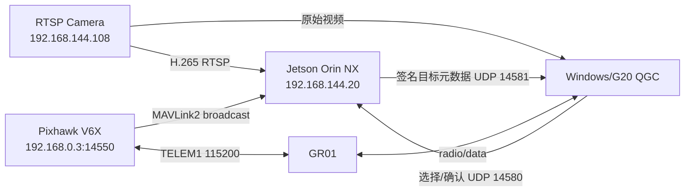
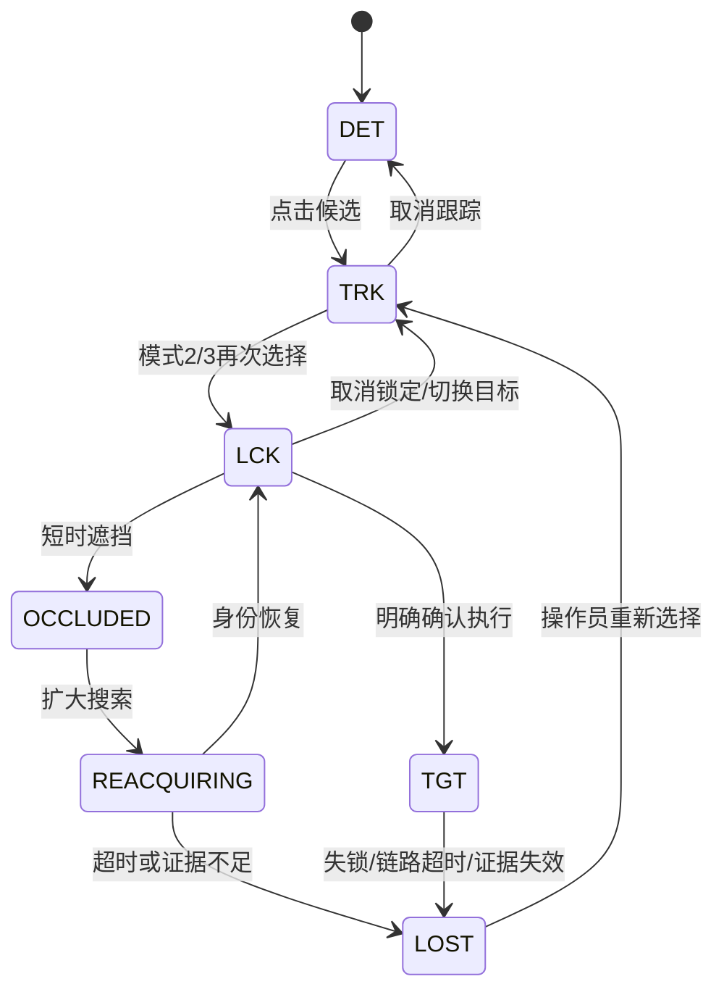
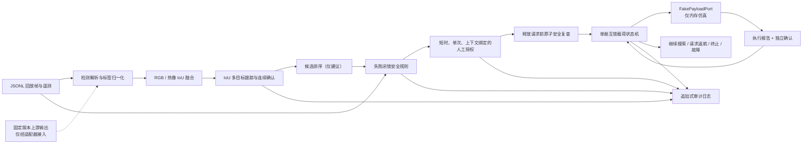
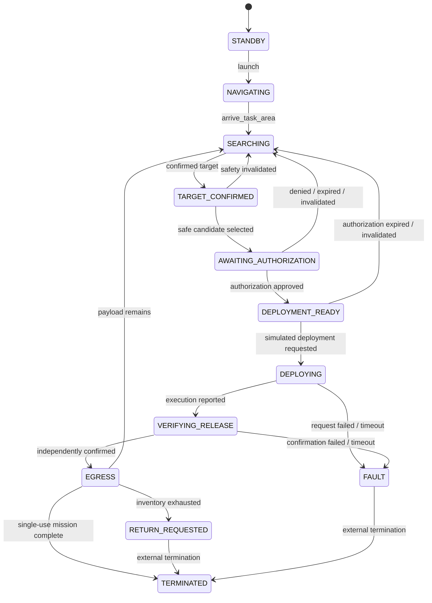

# Multi-Detect

Multi-Detect 是一个固定翼机载视觉、目标跟踪、地面站交互和飞控联动工程。系统把感知候选、多目标跟踪、TRK/LCK/TGT、人工确认、固定相机视轴控制和审计串成同一条实时链路。

三模式统一多目标跟踪、模式 3 固定翼视轴控制、多模态测距和轻量单目避障的需求与验收指标见 [三模式统一多目标感知与任务系统](docs/three-mode-multitarget-system.md)。

> 模式 3 已加入真实 PX4 `SET_ATTITUDE_TARGET` 控制路径；只有 Mode 3、主 LCK、目标绑定确认、PX4 固定翼身份、已解锁、新鲜姿态/目标、最低空速和最低高度同时成立时才预发送 setpoint 并切入 `OFFBOARD`。失锁或任一门限失效后停止控制并恢复进入前的飞行模式（取不到时回退 `AUTO`）。物理载荷释放仍是独立链路，当前实现不发送释放动作。

## 当前工程进度（2026-07-18）

本节是项目当前状态的详细交接记录。状态标记含义如下：

- `[x]`：代码或实机证据已经存在，并且至少完成一次对应验证。
- `[~]`：已经开始实现，但尚未完成编译、实机或用户界面验收。
- `[ ]`：已经确认需求，但尚未开始或尚无可重复证据。
- `[!]`：存在明确阻塞或风险，不能按“已完成”处理。

这里严格区分五种证据：源码存在、自动化测试通过、桌面程序编译成功、真实硬件链路运行、完整任务闭环验收。前四项中的任意一项都不能单独等价为第五项。

### 0. 2026-07-18：算法优化、部署与验收快照

#### 0.1 已落地的算法路径

- `[x]` 新增 `aircraft` 语义族：`aircraft/airplane/aeroplane/plane/helicopter/drone/uav` 统一进入优先候选、目标池、TRK/LCK 与 LCK 专用检测路径；飞机不再继承车辆的阈值与运动假设。
- `[x]` 统一多目标跟踪已按类别使用不同运动门限：人员保持中等动态门限，车辆沿用原有动态关联，飞机使用更宽的预测、中心距离、创新量和重捕获门限；快速平面移动的回归保持同一 ID，而同样跳变的车辆样本不会被错误合并。
- `[x]` 新增 `src/multidetect/aircraft_appearance.py`。该轻量飞机外观描述符只对飞机类生成特征，使用形状、边缘、色彩和长宽比组合，避免将人员/车辆 ReID 特征误用于飞机；缩放与亮度扰动、形状区分、非飞机拒绝和过小裁剪拒绝均有回归覆盖。
- `[x]` LCK 时保留与主目标类别匹配的检测器，并为飞机逐帧刷新飞机外观特征；人员/车辆原有 ReID 路径不被替换。对应 `aircraft_specialist` 路由由单元测试覆盖，尚待真实飞机画面的端到端验收。
- `[x]` 火情时序过滤现在归一化 `fire`/`flame` 等别名，并同时约束候选中心位移和面积变化，减少闪烁轮廓与短暂热色纹理造成的无依据确认；这项改动不等价于火情部署域精度已通过。
- `[x]` 火情时序过滤对同类别相邻火焰改用全局最小代价匹配，不再按置信度贪心抢占历史轨迹；两个重叠投影火焰同时出现时会分别延续各自的连续帧证据，避免其中一个候选被错误重置。`tests/test_vision.py` 覆盖了该回归。
- `[x]` 固定火点的统一目标池新增火情运动画像：全局相机位移仍完整累计，火焰轮廓产生的局部光流残差、速度校正和框尺寸更新则降权。合成相机平移 + 交替轮廓抖动回归中，`flame` 框中心残差范围为 `0.005975`，同输入的通用目标为 `0.017072`；两者均不创建额外 ID。这是算法回归，不代替真实烟火画面的重捕获数据。
- `[x]` 识别效率路径已收紧：无主检测火情候选的帧跳过独立 RGB 火情核验；亮/中性光误报过滤也只转换火情候选 ROI，非火情帧不再做 HSV 转换。核验仍只对已存在的主检测候选提供佐证，不会自行创建目标。
- `[x]` 车辆类别把 `van` 纳入 `vehicle` 语义族、时序别名与车辆 ReID 的已验证车身域；`van → car → truck` 保持一个 ID，受限的帧间位移保持关联，而过大跳变仍拒绝合并。两轮车、船和火车继续走运动关联，未假定车辆 ReID 对这些外观域有效。
- `[x]` 人物 ReID 现在有**仅人员/消防员**的外观关联门限：`person_maximum_appearance_distance` 与 `person_strict_reid_distance`。它们只覆盖 `person/firefighter` 语义族，车辆与飞机继续使用原有共享门限；这避免为了人物转身、尺度和姿态变化放宽车辆/飞机身份关联。Jetson 启动器的可回滚环境变量为 `UNIFIED_TARGET_POOL_PERSON_MAXIMUM_APPEARANCE_DISTANCE`（默认 `0.70`）与 `UNIFIED_TARGET_POOL_PERSON_STRICT_REID_DISTANCE`（默认 `0.22`）。
- `[x]` 显式选中的**所有** TRK（包括已识别的人员、车辆、火焰与普通物体）现在都可使用通过置信门限的短时光流/模板运动提示跨越通用检测器的跳帧；此前只有 manual TRK 和独占 LCK 可使用该桥接，导致已识别 TRK 在检测器空档中在 `OCCLUDED/RECOVERED` 间反复切换。普通 DET 仍只依赖检测器，`LOST` 身份仍需新检测/ReID 证据才能恢复。
- `[x]` 目标池元数据刷新已分三级：普通 DET 维持 `5 Hz`，存在一个或多个显式 TRK 时为 `10 Hz`，独占 LCK 保持 `20 Hz`。这只提高 QGC 目标框元数据刷新，不增加模型推理频率，也不改变飞控配置。
- `[x]` QGC 目标框现在保留按 `targetId` 稳定的渲染 delegate，而不是在每次目标池 UDP 刷新时销毁/重建。TRK/LCK 框、候选 `+` 和 manual fallback 框均以随 `5/10/20 Hz` 元数据率自适应的 `45–110 ms` `OutCubic` 插值移动/缩放，减少可见跳帧；点击命中仍以最新认证坐标计算，不改变目标选择协议。
- `[x]` 模式 3 顶部提示横幅已取消 `scale` 脉冲，尺寸固定；一次新的模式 3 确认只触发一次本地 `alert.wav` 提示音。QML 预加载 `QtMultimedia` cue，重复的状态包不会叠加播放；取消、降级、模式切换或遥控接管后允许下一次新执行再次提示。
- `[x]` 车辆假阳性使用两层 gate。第一层 `VehicleFurnitureOverlapVetoFilter`：若 `car/van/truck/bus/...` 候选有至少 `45%` 自身面积位于置信度至少 `0.35` 的 `chair/couch/bed/dining table/toilet` 框内，则抑制车辆标签但保留家具检测。第二层只在 COCO 与 VisDrone 两个模型同时在线时对 `car` 生效：两个独立 `model_version` 的重叠候选可沿用 `0.60` 车辆门限；单模型 `car` 必须达到 `0.80`。因此室内椅轮/地面纹理的单 VisDrone 误报不会仅因时序稳定而进入 DET/TRK，真实的双模型一致或高置信车仍保留。家具重叠和单源/双源正反例均由 `tests/test_vision.py` 覆盖。
- `[x]` 自动 DET 候选现在有显式类别 allow-list。`VehicleFurnitureOverlapVetoFilter` 仍先读取 `chair/couch/bed/dining table/toilet` 的宽模型上下文以抑制室内假 `car`，随后 `LabelAllowListFilter` 才把 `chair`、`couch`、`bed`、`dining table`、`tv`、`remote` 等室内家具/消费品从自动目标池移除；人员、车辆、飞行器、火情/烟雾和环境风险类别保留。manual 框选在检测器之后独立注入目标池，不受此过滤影响。
- `[x]` 新增 `scripts/evaluate_person_tracking_video.py`：离线读取带 MOT 风格身份标注的公开视频，严格核对视频与 `seqinfo.ini` 的帧数、帧率、尺寸，复用生产 COCO 检测、raw Ultralytics 主机侧 NMS、人物 ReID 与统一目标池，输出 GT/观察/预测 JSONL、模型与视频 SHA-256、IDF1、ID switch、fragmentation、MOTA、遮挡恢复和 P50/P95。它只处理录制文件，不打开 RTSP、不读 MAVLink、不调用控制接口。
- `[x]` 评测器已显式支持 `post_nms_nx6` 与 `ultralytics_raw` 两种模型边界。Jetson 的当前 COCO TensorRT engine 实际输出为 `1×84×8400` raw YOLO，不应按 `N×6` 直接读取；评测器现在走和常驻通用检测器一致的 `OnnxRawYoloDetector` + class-aware NMS 路径。
- `[x]` 分块检测支持逐类别阈值；`airplane=0.82` 已写入 Jetson 启动参数和离线评估工具。当前常驻服务保持 `1×1` 全画幅配置，因此该项不应被解释为 `2×1` 小目标分块已经完成现场启用。
- `[x]` VisDrone 优先检测器新增**源类别**阈值覆盖：`--priority-label-confidence-thresholds` 在标签映射前生效，常驻默认 `truck=0.80`，其余车辆源类别仍为 `0.60`。这不是把 `truck` 映射为 `car`，也不影响 `car/van/bus` 的门限；它只要求 `truck` 具有更高模型证据后才进入时序确认和目标池。
- `[x]` 新增 `scripts/evaluate_priority_video.py`：对录制视频复现优先模型的原始阈值、标签映射、车辆时序确认和帧错峰，并输出逐帧预测 JSONL、原始候选/最终候选计数、类别最高置信度、模型与视频 SHA-256、推理 P50/P95。工具不打开实时相机，不接入飞控或执行器。
- `[x]` 新增 `scripts/evaluate_fire_video.py`：离线读取录制视频和 FURG OpenCV 2.x XML 的 `Rect(x,y,width,height)` 火焰框，复现火焰模型、逐类阈值、亮/中性光 ROI veto 与火焰时序确认；输出 raw/thresholded/vetoed/stable 四阶段逐帧 JSONL、模型/视频/标注 SHA-256、火焰 precision/recall 与稳定跟随的确认延迟、连续漏跟帧数。工具不打开 RTSP、不读 MAVLink、不接入控制接口。
- `[x]` `evaluate_fire_video.py` 还支持 `--expected-label flame|fire|smoke`：当公开视频没有逐帧框标注时，分别记录 raw、阈值、ROI veto、三帧稳定阶段的命中帧率、首次命中帧和最长连续命中帧；该指标是已知正片段的覆盖率，不冒充有空间真值时的 precision/recall。
- `[x]` Jetson 启动脚本将火焰候选参数明确为可覆盖环境变量：`FIRE_FLAME_CONFIDENCE_THRESHOLD` 默认 `0.25`、`FIRE_SMOKE_CONFIDENCE_THRESHOLD=0.30`、`FIRE_CANDIDATE_STABILITY_FRAMES=3`。三帧时序确认保持不变；最新 FIRESENSE 烟雾回归显示 `0.30` 在已测正样本的稳定烟雾覆盖明显高于旧 `0.60`，并在已解码的公开负样本中没有形成稳定烟雾候选。每个变量仍可以在部署环境中单独回滚覆盖。静态预检现已明确区分“候选的三帧视觉证据”和任务目标池的 `minimum_track_observations`，后者仍单独负责目标确认，二者不再被错误绑定为同一个最小值。

#### 0.2 本轮离线验证

- `[x]` 当前工作树已执行 `python -m compileall -q src scripts` 与 `python -m pytest -q`，命令均以退出码 `0` 完成。
- `[x]` 本轮火情固定点、核验跳过、车辆别名/ReID 和 LCK 火情检测路由回归已通过；随后再次执行完整 `python -m pytest -q`，退出码 `0`。
- `[x]` 本轮 QGC/Jetson 目标池闭环补充了稳定 LCK 门禁：只允许 `TRACKING/RECOVERED`、`actionable=true`、`confidence >= 0.35`、`trackingQuality >= 0.45` 的显式 TRK 目标升级为 LCK。QGC 和 Jetson 使用相同阈值，因此弱的一帧候选不会抢占多目标 TRK 或进入独占高频 LCK 路径；当前选中框也会显示目标池提供的相对速度。QGC 的分页目标池短暂空档保留从 `1.0 s` 调整到 `2.5 s`，仍早于全局 `3 s` 元数据失效回收。
- `[x]` 针对识别器 cadence 空档的多 TRK 光流桥接与 `DET/TRK/LCK=5/10/20 Hz` 元数据 cadence 回归已加入；`python -m compileall -q src scripts` 与完整 `python -m pytest -q` 再次以退出码 `0` 完成。
- `[x]` 连续手动框选不再只保留最后一个：Jetson 选择池按 `command_id` 暂存每个 `manual` 观察，在下一次同一目标池更新中一起建立独立 TRK；已新增“两个 manual TRK 在一次 pool update 前连续到达”回归。每个候选仍独立关联，已识别类别会覆盖对应 temporary manual 身份，不影响其他已选 TRK。
- `[x]` QGC 的分页 `TargetPoolStatus` 与 `SceneContextStatus` 现在以“revision + page index”进行顺序判断，不再因为 UDP 传输中 page 1 早于 page 0 到达而丢弃 page 0；同一页的重复/过期序列仍会忽略，快照只在全页齐全后原子更新。C++ 自检覆盖该乱序、重复和同页过期回归。
- `[x]` 定制 QGC 已完成 Release 增量构建、QML cache 编译、`MultiDetectOperatorProtocolSelfTest`（退出码 `0`）和 staging 安装；本轮 `Release/MultiDetectGCS.exe` 与 `staging/bin/MultiDetectGCS.exe` 的 SHA-256 均为 `B8B7BC495B704B14C940E030BDEA36E94595DABE46ACDE4CCD33B0FD85A881D4`。安装包 `build-multidetect-release/MultiDetectGCS-installer-AMD64.exe` 的 SHA-256 为 `387D6242FCC2CAA01ED62C9BC92743458F3865F680917277D8B75514CC26D9C9`。
- `[x]` 本轮 QGC 平滑渲染/提示音改动已完成 Release 构建、QML cache 编译和 `MultiDetectOperatorProtocolSelfTest`（退出码 `0`）。新 `Release/MultiDetectGCS.exe` 与隔离完整包 `build-multidetect-release/staging-ui-smooth/bin/MultiDetectGCS.exe` 的 SHA-256 均为 `2C12A38ABAF5B2D1C22433883611D7B0D75C5E661F7E5077DCB8DFADC7F19301`；新安装包 `MultiDetectGCS-installer-AMD64.exe` 为 `8C514D39AD14320ABB0FD1C139962AAF1CB200FBDACA85787AC2287322BEEB46`。原 `staging/bin` 正被已运行的旧 QGC 占用，故本轮没有强制覆盖它；直接运行隔离完整包或使用新安装包即可验收。
- `[x]` Plan 新增左侧 `区域航线` 工具：在地图上拖拽一个矩形后，QGC 将四个角转换为 GPS 多边形顶点，并在当前任务项之后插入原生 `Survey`。该 Survey 立即复用 QGC 现有的固定翼覆盖路径生成器显示往返航线；已有任务项不被清空，后续仍可在原生 Survey 编辑器调整区域、航向、间距、转弯距离和高度，保存/上传流程不变。本轮 `PlanView.qml` QML lint、Release QML cache 编译和定制回归 `37 passed` 均通过；隔离完整包为 `../QGroundControl-MultiDetect/build-multidetect-release/staging-area-route-20260718T174302/bin/MultiDetectGCS.exe`，与 Release EXE 的 SHA-256 均为 `FDBC1479ECBCDF044F3C6579F41E248ABDA1512B6ADC0E79585C3B552CFC9A9A`，本轮安装包为 `E804BB4A316DE8C31F1AF8486BF51992FB721E681E4B668DD42584211081D671`。
- `[x]` 新车类双源 gate 的本地回归完成：`python -m compileall -q src scripts`、`pytest -q tests/test_vision.py tests/test_jetson_deployment.py` 和随后完整 `pytest -q` 均以退出码 `0` 完成。
- `[x]` COCO128 优先类别离线报告 `artifacts/evaluation/coco128-yolo26n-tiled-priority-aircraft-t082-iou030-t040.json`：全画幅优先类 `TP/FP/FN=196/35/140`，分块候选 `204/36/132`；其中 `airplane=6/0/0`，故选定 `0.82` 以去除此前的 1 个飞机假阳性而不损失该数据集中的 6 个真阳性。该报告是在 Windows 的 ONNX Runtime CPU fallback 下生成，只用于检测质量比较，不代表 Jetson 帧率。
- `[x]` 已下载公开 VisDrone `DET-val`（`548` 张、`38,759` 个有效标注；压缩包 SHA-256 `abeea063…2a35ef9`）并以当前 `yolo26n-visdrone-priority-e30-960` ONNX 做门限回归：`truck=0.60` 为 `TP/FP/FN=126/29/624`、precision `0.813`、recall `0.168`；`truck=0.80` 为 `54/3/696`、precision `0.947`、recall `0.072`。因此 `0.80` 是当前室内无卡车部署域的精度优先门限；真实存在卡车的部署域仍须单独测量召回。
- `[x]` 公开 UA-DETRAC 交通视频样本（`960×540`、`252` 帧、`8.4 s`、视频 SHA-256 `48bedf6f…34bafbc`）已用于端到端视频回放。Windows 生产等价配置在 `63` 次计划推理中保留 `car=1,643`、`bus=92`，原始 `truck=15`（最高 `0.708103`）全部未进入最终输出；Jetson TensorRT engine 的前 `60` 帧复测在 `15` 次推理中为 `car=335`、`bus=13`、原始 `truck=9`、最终 `truck=0`，P50/P95 `95.284/105.583 ms`。随后以同一 engine 完整复放 `252` 帧：`63` 次计划推理、`189` 帧按 cadence 跳过，稳定输出覆盖 `car=1,646`（`61` 个输出帧）、`bus=92`（`61` 帧）、`person=566`（`63` 帧）、`motorcycle=17`；原始 `truck=18` 的最高置信度仅 `0.653127`，最终 `truck=0`，计划推理 P50/P95 `75.268/120.697 ms`。`van` 的 `289` 个原始候选已按既定别名并入 `car`，没有拆成平行轨迹。来源和可复现命令记录在 `artifacts/evaluation/public-video/ua-detrac-evadb/` 与 `artifacts/deployment/jetson-bench/public-ua-detrac-priority-engine-full-20260718.json`（大文件受 `.gitignore` 管理）。
- `[x]` 已获取公开 [FURG Fire Dataset](https://github.com/steffensbola/furg-fire-dataset) 的 `hand_held_camera_wildfire`（`773` 帧）、`barbecue`（`902` 帧）与无火 `non_fire_patrolbot_onboard`（`341` 帧），每个视频均有对应火焰矩形 XML。FURG 只标注火焰、未标注烟雾，因此量化分数只统计 `flame`。Windows CPU ONNX 回放中，旧 `flame=0.72/stability=6` 的两段正样本 stable 总计为 `TP/FP/FN=12/0/1621`、recall `0.007`；调优后的 `0.25/3` 为 `846/197/787`、precision `0.811`、recall `0.518`，无火视频 stable flame 为 `0`。实际 Jetson TensorRT FP16 engine 对相同调优参数复测为 `873/205/760`、precision `0.810`、recall `0.535`；三段视频 P50/P95 分别为 `23.710/35.996 ms`、`24.634/37.337 ms`、`20.299/32.309 ms`，无火视频 stable flame 仍为 `0`。证据位于 `artifacts/evaluation/public-video/furg-fire/` 与 Jetson 的 `artifacts/deployment/jetson-bench/public-furg-fire-engine-20260718/`。
- `[x]` 已下载公开 [MathWorks PedestrianTracking MOT 序列](https://www.mathworks.com/help/vision/ug/import-camera-based-datasets-in-mot-challenge-format-for-object-tracking.html)：`169` 帧、`1288×964`、`1 FPS`、`14` 个身份；本地 MP4 SHA-256 为 `917121ce…1f40b4`，标注 SHA-256 为 `d918095e…dc95c0`。同一离线序列在 Jetson Orin NX 的真实 TensorRT `raw YOLO + person ReID` 路径上复放：无 ReID 时 `IDF1=0.513841`、`ID switch=65`、`MOTA=0.701754`、遮挡恢复率 `0.50`；旧共享 ReID gate `0.38` 反而退化为 `IDF1=0.455017`、`ID switch=86`、`MOTA=0.645933`、恢复率 `0.25`。使用冻结的同一检测/ReID 观察缓存扫过 `0.50–0.95` 后，人员专属 gate `0.70` 是最小的稳定优值：`IDF1=0.643599`、`ID switch=26`、`fragmentation=16`、`MOTA=0.760766`、遮挡恢复率 `0.75`；相对旧 ReID gate，IDF1 `+0.188582`、ID switch `-60`。完整端到端复放的检测 P50/P95 为 `24.768/36.473 ms`，ReID P50/P95 为 `21.274/41.791 ms`。Jetson 证据为 `artifacts/deployment/jetson-bench/public-person-tracking-person-reid-tuned-20260718.json`；参数扫描索引为 `public-person-tracking-reid-sweep-20260718.json` 和 `public-person-tracking-reid-fine-sweep-20260718.json`。
- `[x]` 本轮公开火烟复测直接使用 Jetson 当前 FP16 TensorRT engine（SHA-256 `ce08b662…775e66f6d`），证据位于 `artifacts/evaluation/public-fire-smoke-20260718/`（Windows 样本）及 Jetson 同路径。FURG `house1`（`899` 帧、有火焰矩形标注）在常驻参数 `flame=0.25/stability=3` 下 stable flame 为 `TP/FP/FN=513/19/504`、precision `0.9643`、recall `0.5044`；较低门限/两帧组合只带来有限 recall 增量且显著增加 false positives，故火焰参数保持。FIRESENSE `testpos01`（`407` 帧、已知烟雾正片段）在旧 `smoke=0.60` 时 stable smoke 覆盖 `10.32%`，`0.30` 为 `42.75%`；FIRESENSE 九段公开无烟视频共解码 `7,153` 帧，`0.30` 产生 `31` 个 raw smoke 候选但 `0` 个 stable smoke 候选。`testneg03` 因 Jetson AVI 解码只读取 `182/748` 帧，结论只覆盖已解码部分；烟雾视频没有空间框标注，因此这不是烟雾 mAP/recall 声明。启动器和模板的默认 smoke 阈值已切换为 `0.30`，仍保留三帧时序门限。
- `[x]` `2026-07-19` 相机整体平移回归补齐：背景稀疏 LK 在大位移失配后，仅当首帧仍有足够的**非目标背景特征**时才启用 Hanning-window phase correlation 平移回退；响应至少 `0.50`、位移仍受原 `0.25` 归一化上限约束。`72/320=0.225` 的合成相机横移（等效 1280 宽画面约 `288 px`）现在同时通过全局运动估计、局部残差和“检测器空档 + visual confirmation”目标池连续框回归；背景不足时不会把单一移动目标误当相机平移。
- `[x]` 同日修复 Mode 3 视觉中断后的挑战状态：任意 abort 会清除已过期 challenge，避免 Jetson 生成 `confirmation expiry cannot predate status` 后抑制后续状态包；`OCCLUDED/REACQUIRING/LOST/target_evidence_stale` 恢复为稳定 `LOCKED/TRACKING` 时保留原 LCK 绑定、重新发出**新的**人工确认挑战，不会继续旧确认。遥控/操作员取消以及非视觉安全条件 abort 仍保持闭锁。`RECOVERED` 单帧只等待稳定跟踪，不再立即把已恢复的视觉证据写成 abort。
- `[x]` `2026-07-19` 不稳定固定相机补偿扩展为相似变换：`CameraMotionEstimate` 现在携带 `dx/dy + scale + rotation_deg + aspect_ratio`。统一目标池对每条轨迹组合全局平移、缩放和以画面中心为基准的滚转；16:9 画幅先按像素几何换算，避免直接在归一化坐标旋转导致横纵比例失真。检测重关联、Kalman 预测、轴向协方差、速度状态和 visual-confirmation 提交均在当前相机姿态坐标系内转换；短时 LK 的局部残差先扣除该目标所在位置的全局旋转/缩放位移。背景 RANSAC 仿射估计与单目稀疏流元数据同步输出滚转和画幅比例，偏航/俯仰造成的常见画面平移/缩放与滚转走同一预测链。新增 16:9 离轴目标 `12° + 1.06× + 平移` 检测器空档回归、速度随 `90°` 视觉滚转转轴回归、单目元数据与 live 传递回归；`compileall` 和完整 `pytest -q` 均通过。
- `[x]` 随后将全局模型进一步提升为**有界全仿射**：背景 LK 首选 `estimateAffine2D`，在四参数拟合失败时回退到旧的相似变换，再回退 phase correlation；有效仿射须满足正行列式、整体尺度 `0.80–1.25`、各向异性不超过 `1.35`，避免弱纹理/错误匹配把目标框拉斜。仿射矩阵在归一化画面中心坐标中逐帧复合，统一目标池同时变换目标中心、框的轴对齐范围、速度和独立轴 Kalman 协方差；因此小幅偏航/俯仰造成的剪切、非等比变化和滚转不再压缩为单一平移或统一缩放。新增离轴目标 `[[1.04, 0.06], [-0.03, 0.96]] + 平移` 的检测器空档连续框回归，且 live 的单目运动元数据可携带完整 `affine` 四元组。全部 Python 回归与 Ruff 通过；真实 RTSP 仅证明链路和仿射字段，真实飞行姿态范围的精度仍待室外真值验证。

#### 0.3 Jetson 当前在线状态

- `[x]` 2026-07-18 最新同步：`vision.py`（`c9447f03…d7015345`）、`cli.py`（`349d7d28…960240a0`）、`live.py`（`c6c3d250…743838cb`）、启动器与火烟评测器已原子同步到 Jetson，阶段目录为 `/home/jetson/Multi-Detect/.codex-stage-chair-fire-smoke-20260718T091814Z`，可回滚副本为 `/home/jetson/Multi-Detect/.codex-backup-chair-fire-smoke-20260718T091814Z`。远端 `compileall`、候选过滤导入与 shell 语法检查通过；服务重启后为 `active`（当次 PID `20136`），实际参数为 `flame=0.25`、`smoke=0.30`、`stability=3`，`MODE3_AIM_CONTROL_ENABLED=0` 未变，进程没有 `--fixed-wing-aim-control`。重启后最新 `300` 个预测帧的最终类别仅为 `person=174`、`flame=8`，没有 `chair/couch/tv/remote` 自动候选；同会话审计 `4,152` 行中 error-like 事件为 `0`。本地汇总清单为 `artifacts/evaluation/public-fire-smoke-20260718/jetson-public-fire-smoke-regression-20260718.json`（SHA-256 `47a6ee0e…7ef778b9`）。
- `[x]` 本轮代码已通过暂存目录原子同步到 `/home/jetson/Multi-Detect`，远端编译/导入检查通过后重启 `multidetect-live.service`。可回滚副本为 `/home/jetson/Multi-Detect/.codex-backup-20260718T022609Z` 与 `/home/jetson/Multi-Detect/.codex-backup-20260718T023451Z`。
- `[x]` 重启后的现场快照显示服务处于 `active/running`，识别到 `person`、`chair`，处理速率约 `12.73 Hz`，审计错误计数为 `0`，目标池已恢复多个 ID。此证据证明服务和模型链重新上线，不代替类别准确率或交互闭环验收。
- `[x]` 2026-07-18 后续只读快照：当前常驻 `1×1` 服务连续 600 帧约 `12.26 Hz`，窗口内有 `person/chair/remote/tv` 目标，审计错误事件为 `0`；`2×1` 常驻配置没有改动。现场画面未出现可标注的车辆、飞机或火焰，因此该窗口不作为这些类别的 precision/recall、ID switch 或 `aircraft_specialist` 端到端通过证据。
- `[x]` 已完成同机 360 帧的短时 `1×1`/`2×1` A/B：两次均为真实 RTSP、真实只读 V6X（发送 `0`）、`MODE3_AIM_CONTROL_ENABLED=0`，且队列高水位均为 `1`、重连均为 `0`、目标池错误均为 `0`。两次试验使用相同的隔离启动环境，未加载常驻服务的 ReID drop-in，因此用于比较分块检测开销而非替代全量常驻基准。`1×1` 稳态处理 `13.84 Hz`、推理 P95 `73.38 ms`、帧龄 P95 `156.84 ms`；`2×1` 分别为 `12.92 Hz`、`106.37 ms`、`195.90 ms`。`2×1` 代价约为 `0.92 Hz` 和 `32.99 ms` P95；试验画面没有飞机真值，尚未证明小飞机召回收益，故常驻服务继续保持 `1×1`。
- `[x]` 本轮没有向在线链路发送 LCK 选择、执行确认或飞控控制指令；常驻服务的 `MODE3_AIM_CONTROL_ENABLED=0` 保持不变。
- `[x]` 上述火情固定点、核验跳过和车辆路径已完整同步到 Jetson：归档包含 `302` 个代码、配置、脚本、文档和测试文件，远端逐文件 SHA-256 校验 `302/302` 一致。大体积训练数据、模型制品、虚拟环境、运行证据和运行时环境文件不进入该源码归档；远端可回滚副本为 `/home/jetson/Multi-Detect/.codex-backup-20260718T031626Z`。
- `[x]` 同步后远端 `compileall`、核心模块导入与启动脚本检查通过；修复 Windows 打包时丢失的 shell 可执行位后，`multidetect-live.service` 重启为 `active/running`（当次 PID `13410`）。系统服务中的 `MODE3_AIM_CONTROL_ENABLED=0` 未改变，主进程命令行未含 `--fixed-wing-aim-control`。
- `[x]` 新服务真实 RTSP 窗口已持续写入审计、预测和身份跟踪文件：抽查时累计 `1,022` 个预测帧、`1,344` 个审计事件、审计错误事件 `0`，三个输出文件在 8 秒采样内均持续增长。窗口中为 `chair/person` 与 `truck` 候选，尚不构成车辆或火情精度验收。
- `[x]` 用户已明确当前室内 RTSP 不存在真实 `truck`。旧窗口的 `33` 个最终 `truck` 候选全部来自 `visdrone-e30-960-20260716`，置信度 `0.602062–0.787931`、框面积 `0.109210–0.114631`，集中在同一右侧室内区域，按已知负例处理。`truck=0.80` 同步重启后，新窗口 `709` 个预测帧只输出 `chair=533/person=202/tv=2`，`truck=0`、审计错误 `0`。
- `[x]` 本轮阈值与视频评测工具已以阶段目录 `/home/jetson/Multi-Detect/.codex-stage-20260718T034740Z-truck-gate` 同步；远端可回滚副本为 `/home/jetson/Multi-Detect/.codex-backup-20260718T034740Z-truck-gate`。远端 `compileall`、启动脚本语法和 CLI 默认值检查通过；服务 `active/running`，`MODE3_AIM_CONTROL_ENABLED=0` 保持，主进程未带 `--fixed-wing-aim-control`。
- `[x]` 公开 FURG 火焰视频评测脚本、火焰阈值/时序默认值、环境模板、README 和对应测试已以 `/home/jetson/Multi-Detect/.codex-stage-20260718T-fire-tuning-deploy` 同步；远端回滚副本为 `/home/jetson/Multi-Detect/.codex-backup-20260718T-fire-tuning-deploy`。六个同步文件 SHA-256 全部与 Windows 源文件一致，远端 `compileall`、启动脚本语法、评测工具 `--help` 均通过；`multidetect-live.service` 重启后保持 `active`，进程确认使用 `flame=0.25`、`smoke=0.60`、`stability=3`，且未带 `--fixed-wing-aim-control`。实际 TensorRT 离线回放证据已归档为 `/home/jetson/Multi-Detect/artifacts/deployment/jetson-bench/public-furg-fire-engine-20260718/`。
- `[x]` 人物跟随评测器、人员专属 ReID gate、CLI 与 Jetson 启动器已同步到 Jetson；四个文件逐个 SHA-256 校验一致，远端 `compileall`、评测器 `--help` 与启动脚本语法通过。回滚副本为 `/home/jetson/Multi-Detect/.codex-backup-person-reid-gate-20260718T050811Z`。常驻服务原本已带人物 ReID；完成离线复放后已重启加载新代码，当前 PID `16320`、`active/running`，命令行确认包含 `--person-reid-onnx`、人员 gate `0.70`、严格 ReID gate `0.22`，且不含 `--fixed-wing-aim-control`。新会话 `jetson-live-20260718T051222Z` 的 audit/prediction 文件已持续生成；进程日志只有 TensorRT plan 可移植性和 RTSP 时长查询 warning，没有 `Traceback`、`Exception` 或运行时 `ERROR`。同步时已恢复启动脚本可执行位 `0755`。
- `[x]` QGC LCK 门禁对应的 Jetson `src/multidetect/selection_target_pool.py` 已原子同步；本地与远端 SHA-256 均为 `8d1f6faac299b7bab2f35e5b755747c5196d734a55044660c62c825aadbfe57e`，远端可回滚副本为 `/home/jetson/Multi-Detect/.codex-backup-qgc-lck-gate-20260718T054858Z`。`compileall` 后 `multidetect-live.service` 重启为 `active`，新的 `jetson-live-20260718T054853Z` 会话在 8 秒内增长 `100` 个 prediction/identity-tracking 帧与 `132` 条 audit；最近服务日志无 `Traceback`、`Exception`、`ERROR` 或 `CRITICAL`。人员 ReID `0.70/.22` 保持，`MODE3_AIM_CONTROL_ENABLED=0` 未变。
- `[x]` 多 TRK 视觉桥接和 `5/10/20 Hz` 目标池 cadence 已同步：`live.py` SHA-256 `c65d69cd2587badb9070dd53625ce14a1935db96abc7f02e0e6a3ff427374efd`、`selection_target_pool.py` 为 `307d2fd5678737d90ccff9c259fd40619ec4f852b1861e51da21f6044b12ea60`，远端可回滚副本为 `/home/jetson/Multi-Detect/.codex-backup-trk-cadence-20260718T060030Z`。服务重启后保持 `active`，新会话 `jetson-live-20260718T060026Z` 在 8 秒内增长 `100` 个 prediction/identity-tracking 帧与 `131` 条 audit；抽样 `300` 帧推理 P50/P95 为 `41.28/74.65 ms`，现场候选为 `person/chair/suitcase`。`MODE3_AIM_CONTROL_ENABLED=0` 保持。
- `[x]` 多 manual TRK 队列改动已同步到 Jetson：`selection_target_pool.py` SHA-256 `9a3b5ef50190c9427a0f23f619d72e582dbae07dfeaa158c703d64300d35569f`，远端可回滚副本为 `/home/jetson/Multi-Detect/.codex-backup-manual-multitrk-20260718T072247Z`。重启后 `multidetect-live.service=active`，新会话 `jetson-live-20260718T072242Z` 的 10 秒窗口增长 `116` 条 prediction、`116` 条 identity-track、`207` 条 audit；最近 300 帧推理 P50/P95 为 `33.47/75.64 ms`。`MODE3_AIM_CONTROL_ENABLED=0` 保持，进程未带 `--fixed-wing-aim-control`。
- `[x]` 本轮车辆家具重叠 veto 已原子同步到 Jetson：`vision.py` SHA-256 `b32449bcea44f38ff90c053aecbfa5d0e97c7bcf368027a62a14a79b4e409239`、`cli.py` 为 `baed83da0485326e8ec9dc0242192d356650bd92cec87c42ef7fec77cb68b287`。阶段目录为 `/home/jetson/Multi-Detect/.codex-stage-ui-smooth-20260718T081057Z`，回滚副本为 `/home/jetson/Multi-Detect/.codex-backup-ui-smooth-20260718T081057Z`。远端 `compileall` 与 `VehicleFurnitureOverlapVetoFilter`/CLI 导入通过，`multidetect-live.service=active`（当次 PID `17924`），进程仍不含 `--fixed-wing-aim-control`。
- `[x]` 随后单源/双源 `car` gate 已同步：`vision.py` SHA-256 `d7ae31c4b66a62561342a5acf314079c850ccbf49b71f1655f44b9df1e31dbda`、`cli.py` 为 `3175e3b12f8032f82f370a440c9b60c71dc9030fecc2395c1f2b77f596c254c3`、启动器 `run_jetson_fire_patrol.sh` 为 `23eeb66e6ca8ab0a4918c7bd01616391c162212ca98c9de40b7a37b75f62278f`。阶段目录为 `/home/jetson/Multi-Detect/.codex-stage-car-consensus-20260718T082149Z`，回滚副本为 `/home/jetson/Multi-Detect/.codex-backup-car-consensus-20260718T082149Z`。重启后服务 `active`（PID `18248`），运行 `270` 帧的当前室内 RTSP 窗口为 `chair=85/person=13/suitcase=23/tv=44/car=0`，推理 P50/P95 为 `51.184/77.722 ms`。变更前同画面 `600` 帧有 `207` 个 `car`，全部来自单一 `visdrone-e30-960-20260716`，置信度 `0.600188–0.775945`；本次窗口证明当前假阳性已被该 gate 抑制，不代表真实道路车辆召回已完成验收。`MODE3_AIM_CONTROL_ENABLED=0` 保持，进程不含 `--fixed-wing-aim-control`。
- `[x]` `2026-07-19` 已将 `approach_hil.py`、`approach_live.py`、`short_term_tracking.py` 同步到 Jetson；远端 SHA-256 分别为 `b6285874…730d008`、`ceb1737d…74b5dfa`、`5b1ed4e2…2d81a2cc`，备份在 `/home/jetson/Multi-Detect/artifacts/deployment/camera-motion-approach-fix-20260719T102643Z/backup/`。服务通过其 `Restart=always` 策略重启后为 `active`（PID `22963`）；新审计会话 `jetson-live-20260719T022704Z.audit.jsonl` 已写入超过 `1,100` 行，未出现 `approach_hil.processing_failed`。当前进程继续保持 `--short-term-tracking --short-term-analysis-width 320 --short-term-frame-stride 1`，未带 `--fixed-wing-aim-control`。
- `[x]` 定制 QGC 同步补齐挑战 UI 的本地倒计时与恢复提示：挑战到期会结束可点击状态；Jetson 报告可恢复视觉中断时弹窗显示“目标重捕获中”，新 challenge 到达后才重新允许确认。`qmllint`、`tools/tests/test_multidetect_custom_app.py`（`38 passed`）、`MultiDetectOperatorProtocolSelfTest.exe` 均通过；Release 和完整隔离包 `../QGroundControl-MultiDetect/build-multidetect-release/staging-camera-motion-approach-fix-20260719T102908/bin/MultiDetectGCS.exe` 的 SHA-256 均为 `BAA5C175740DCA354DBBAD06DED6947FE1D43A48DD9157F34CCC5A1D6F294A3F`。
- `[x]` `2026-07-19` 滚转/缩放不稳定相机补偿已同步到 Jetson：`unified_tracking.py=7f126c73…54fde09c`、`short_term_tracking.py=1a16408d…2c629115`、`monocular_avoidance.py=a5269d5f…1daf6b3b`、`live.py=166b3bd0…09704f9d`；同步、远端 `compileall` 和四模块导入检查均通过。备份、stage、部署校验和服务审计位于 `/home/jetson/Multi-Detect/artifacts/deployment/attitude-camera-tracking-20260719T024811Z/`。服务重启后为 `active`（PID `23376`，`NRestarts=2`），新会话 `jetson-live-20260719T024846Z.audit.jsonl` 在验收时已有 `1,510` 条记录、error-like 事件 `0`。真实 RTSP 已写出 `tracking.background_camera_motion_ready`，details 含 `rotation_deg` 和 `aspect_ratio`；当前静态画面滚转约 `-0.000026°`，说明字段来自真实链路而不是模拟值。进程保持 `--short-term-tracking --short-term-analysis-width 320 --short-term-frame-stride 1`，未带 `--fixed-wing-aim-control`。
- `[x]` `2026-07-19` 有界全仿射补偿已同步到 Jetson：`unified_tracking.py=81540441…e8965bcc`、`short_term_tracking.py=69315345…0d7217a3`、`monocular_avoidance.py=5e96a6fa…0a2a3969`、`live.py=c2b3c4c1…d707c214`；远端 OpenCV `4.5.4` 已确认支持 `estimateAffine2D`，同步后 `compileall`、模块导入和 OpenCV 能力检查均通过。备份、stage、哈希、进程和审计证据在 `/home/jetson/Multi-Detect/artifacts/deployment/affine-camera-tracking-20260719T025816Z/`。服务重启后为 `active`（PID `23755`，`NRestarts=3`），会话 `jetson-live-20260719T025837Z.audit.jsonl` 验收时为 `875` 条事件、error-like `0`；`tracking.background_camera_motion_ready` 已真实包含 `affine=[1.0,-0.0,-0.0,1.0]`、`rotation_deg`、`aspect_ratio` 和 source。静态室内画面不产生可量化偏航/俯仰真值，故该现场证据只证明在线链路，不宣称姿态域精度。
- `[x]` `2026-07-19` 有界背景 Homography 已接入不稳定相机链路：全局背景特征继续排除所有已知目标区域；仅当 RANSAC 透视项达到 `0.008–0.35`、中心局部尺度/各向异性/旋转/平移仍在原门限内时，才使用 `background_homography_flow`。纯平移、滚转、缩放和小幅偏航俯仰继续走全仿射、相似或 phase-correlation 回退，避免把数值近似仿射的 RANSAC 抖动误当透视。统一目标池现在累计完整 projective transform、投影四个框角，并以目标位置处 Jacobian 更新速度和 Kalman 方差；检测器空档中的局部光流残差仍在相机补偿后叠加。Live runner 优先采用目标排除背景结果，单目仿射只在背景特征不足时回退；审计新增 `homography` 字段。新增离线透视 warp + 刻意错误外部运动回归，确认背景 Homography 优先并保持 visual-confirmation 连续框；本地 `compileall`、Ruff 和完整 `pytest -q` 均通过。Jetson 同步版本为 `unified_tracking.py=28ec00aa…b323ad02`、`short_term_tracking.py=ef3faa0d…d390cd7d`、`live.py=20653878…ad5bbbe68`，证据目录 `/home/jetson/Multi-Detect/artifacts/deployment/perspective-camera-tracking-20260719T031152Z/`；服务重启后 `active`（PID `24319`，`NRestarts=4`），会话 `jetson-live-20260719T031229Z.audit.jsonl` 已解析 `451` 条事件、error-like `0`，真实静态 RTSP 的首个背景事件为 `background_affine_flow` 且 `homography=null`。同一 Jetson OpenCV `4.5.4` 还实际执行了离线透视 warp smoke：`background_homography_flow`、`160` 个背景特征、`1` 个局部提示，结果见 `jetson-homography-smoke.json`。因此在线路径已验证；仍需在可控偏航/俯仰/滚转记录上采集透视真值，才能量化 Homography 的现场收益。

- `[x]` `2026-07-19` 继续修正透视下的动态目标短时预测：此前局部光流把 `track.velocity × dt` 在相机变换后直接相加，透视、滚转或仿射剪切时速度方向与尺度仍处于旧图像坐标。`CameraMotionEstimate` 现提供任意目标位置的 local Jacobian/local area scale；短时 tracker 先计算目标的匀速预测点，再把该点经过 Homography，并按同一位置的 local scale 计算光流尺度残差。离线回归覆盖偏心高速目标，确认输出与“预测点 → Homography”完全一致、且 local scale 不再错误等同画面中心 scale。本地完整 `pytest -q` 通过。Jetson 增量同步为 `unified_tracking.py`、`short_term_tracking.py`，证据目录 `/home/jetson/Multi-Detect/artifacts/deployment/perspective-local-motion-20260719T031650Z/`；服务为 `active`（PID `24879`，`NRestarts=5`）。同机 smoke 再次得到 `background_homography_flow`、`160` 个背景特征与 `1` 个局部提示；动态预测 smoke 的 local scale `0.9483319` 与画面中心 scale `0.9034920` 明确不同，且计算结果与预期一致。新 RTSP 会话 `jetson-live-20260719T031658Z.audit.jsonl` 最近 `300` 条事件没有 error-like 类型。

- `[x]` `2026-07-19` 短时跟踪的模板回退已接入相机重投影：当局部 LK 特征不足时，tracker 将上一帧分析灰度图按已确认的背景 Homography（仿射、滚转、缩放和透视均适用）重投影到当前相机坐标，再从投影后的目标框截取模板；旧的原始模板与 retained-template 回退仍保留给没有相机运动或跨帧保留模板场景。这样相机自身造成的旋转、缩放与透视畸变不会直接降低模板相关性，局部目标残差继续在重投影后计算。新增“LK 稀疏 + 14°滚转 + 1.12×缩放”回归：只走 `camera_warped_template_correlation`，残差 `|dx|,|dy| <= 0.01`，visual confirmation 框连续。本地完整 `pytest -q` 通过。Jetson 同步 `short_term_tracking.py=ac72fe3b…2d06c5c7`，证据目录 `/home/jetson/Multi-Detect/artifacts/deployment/camera-warped-template-20260719T032201Z/`；服务为 `active`（PID `25264`，`NRestarts=6`）。Jetson OpenCV `4.5.4` 实测同一 smoke 得到 `camera_warped_template_correlation`，残差 `dx=0.0009642/dy=0.0019812`、处理 `3.145 ms`；最新真实 RTSP 审计最近 `300` 条为正常 `perception.observation_evaluated`，没有 error-like 事件。

- `[x]` `2026-07-19` 批量局部 LK 已改为使用相机补偿逐点初值：此前即使背景 Homography 已知，`calcOpticalFlowPyrLK` 仍从上一帧像素位置盲搜；现在每个目标特征点先叠加目标速度预测，再经当前相机 Homography 映射到本帧，并以 `OPTFLOW_USE_INITIAL_FLOW` 作为前向 LK 初值。没有可信相机运动时保持原来的无初值路径；反向 LK 和 forward/backward 一致性门限不变。新增回归直接捕获 OpenCV 调用，确认 `8 px` 平移时初值中位位移精确为 `8.0 px`、flag 已设置且局部残差仍接近零；本地完整 `pytest -q` 通过。Jetson 同步 `short_term_tracking.py=e522dc55…dc51027f`，证据目录 `/home/jetson/Multi-Detect/artifacts/deployment/camera-seeded-lk-20260719T032558Z/`；服务为 `active`（PID `25677`，`NRestarts=7`）。Jetson OpenCV `4.5.4` smoke 实测得到 `optical_flow_fb`、seeded `dx=8.0 px/dy=0.0 px`、`flags=4`（`OPTFLOW_USE_INITIAL_FLOW`），处理时间 `9.282 ms`；最新真实 RTSP 审计最近 `300` 条没有 error-like 事件。

- `[x]` `2026-07-19` retained-template 跨遮挡相机补偿已补齐：原有保留模板只缓存最后可靠外观；目标暂时不可见期间如果连续发生滚转、缩放、偏航/俯仰对应的 Homography，重新出现时会把旧外观直接与当前画面比较而失配。现在每个保留模板保存捕获像素框与 `capture→current` Homography；每帧仅在连续、置信度至少 `0.5` 的相机运动下累乘，若帧被 stride 跳过、时间/几何无效或相机运动缺失则立刻使几何链失效并保留旧的原始模板回退，避免伪造未测量运动。重捕获时将历史灰度 crop 重投影到当前坐标，使用 `camera_warped_retained_template_correlation`；旋转边缘使用常量边界，不再把目标纹理镜像进三角角落。新增“两段 `7° + 1.04×` 姿态变化 + 中间完全遮挡 + flame 重现”回归：局部 LK 为 `0`，重投影 retained template 为唯一提示，`|residual dx|, |residual dy| <= 0.01`，并恢复同一 track 为 `RECOVERED`。本地 `compileall`、Ruff 和完整 `pytest -q` 均通过。Jetson 已同步 `short_term_tracking.py=918e9772…8130c826`，证据目录 `/home/jetson/Multi-Detect/artifacts/deployment/retained-template-camera-warp-20260719T033557Z/`；远端 OpenCV `4.5.4` 同一 smoke 输出 `camera_warped_retained_template_correlation`、`dx=0.0017034/dy=-0.0012599`、置信度 `0.9204`、处理 `5.793 ms` 且状态为 `recovered`。服务重启后 `active`（PID `26214`，`NRestarts=8`）；新 RTSP 审计会话 `jetson-live-20260719T033639Z.audit.jsonl` 已写入 `254` 条事件，error-like 为 `0`。
- `[x]` `2026-07-19` 多目标测距元数据隔离已原子同步到 Jetson：`live.py=516ecf01…f45de43d`、`test_live.py=dfbc87dd…d4b3b8c3a` 与本 README 逐文件 SHA-256 均一致；回滚副本为 `/home/jetson/Multi-Detect/.codex-backup-multitarget-metric-isolation-20260719T123552Z/`。远端 `compileall` 与新 `live` 模块导入通过；远端运行虚拟环境未安装 `pytest`，故回归由 Windows 本地完整 `1113` 项套件承担。服务重启后 `active/running`、`NRestarts=0`，进程未带 `--fixed-wing-aim-control`，`MODE3_AIM_CONTROL_ENABLED=0` 保持。最新 RTSP 会话 `jetson-live-20260719T043628Z` 的 8 秒窗口增长审计 `126`、预测 `105`、身份轨迹 `105` 条，最近 300 条审计 error-like 为 `0`。
- `[x]` `2026-07-19` QGC 候选渲染已与 Jetson 的飞机语义族对齐：`aircraft/airplane/aeroplane/plane/helicopter/drone/uav` 现在和人、车、火烟一样可进入可点击 DET 候选池，不会在地面站端被误过滤。人员别名统一蓝色、车辆别名统一绿色、飞机族统一青色；每类候选因此不会再退回白色默认标记。多 TRK 框旁的可视 `LCK` 按钮同时修正为读取该稳定渲染 delegate 的 `entry`，其 enabled 状态现在与实际 `actionable/confidence/trackingQuality` 门限一致。`tools/tests/test_multidetect_custom_app.py` 为 `38 passed`，`qmllint` 退出码 `0`，`MultiDetectOperatorProtocolSelfTest.exe` 退出码 `0`，完整便携运行目录为 `../QGroundControl-MultiDetect/build-multidetect-release/staging-exe-aircraft-colors-lock-20260719T120124Z/bin/MultiDetectGCS.exe`，其中 EXE SHA-256 为 `DE486B145FE0FCFDA76278C70CE36C70E8161C1F78E7F7C9D8AF820E50C41F7B`，运行时文件数为 `1011`；`--help` 与 `--offline --simple-boot-test` 均以退出码 `0` 完成。
- `[x]` `2026-07-19` QGC 的 `LCK/TGT` 现在在本地交互层也保持独占：处于 `LCK/TGT` 或仍在等待主 LCK 确认时，新的手动框选会被阻止，Fly View 的“框选目标”入口同步禁用；必须先返回 `TRK`，不会再用新 manual 框覆盖已锁定目标的本地身份。选中框的“距 / 方 / 速”已改为按 `targetId` 绑定：只有 `RangeStatus.targetId` 与当前框一致时才显示其测距/方位；迟到的旧目标包会被忽略，当前 `TrackStatus/TargetPoolStatus` 的视觉估计可作为回退，避免把前一个目标的数据贴到新框上。`tools/tests/test_multidetect_custom_app.py` 为 `39 passed`，相关 QML lint 与 `MultiDetectOperatorProtocolSelfTest.exe` 均退出 `0`。新完整便携运行目录为 `../QGroundControl-MultiDetect/build-multidetect-release/staging-exe-metrics-target-binding-20260719T121328Z/bin/MultiDetectGCS.exe`，EXE SHA-256 为 `FA937607DD70207786207C48406AA87313306B31F78B0700F34151F189CEE20B`，运行时文件数为 `1011`（排除 staging、未完成安装和验证日志文件）；`--help` 与 `--offline --simple-boot-test --allow-multiple --no-windows-assert-ui` 均以退出码 `0` 完成。
- `[x]` `2026-07-19` 多目标测距/方位/速度发布改为逐目标隔离：`LiveMissionRunner` 中一个候选的几何、测距或速度计算异常只记录该 `target_id` 的审计错误，不再中断同帧其余 TRK/LCK 目标的 `relativeBearingDeg / estimatedRangeM / targetSpeedMps` 元数据。新增“双目标中一个测距失败、另一个仍完整上报”的回归。QGC 选中目标采用新 `TargetPoolStatus` 快照时会主动清空不可用的距离/方位值，避免旧目标或旧帧的数值残留在当前框上。核心 `compileall`、完整 `pytest -q`（收集 `1113` 项）和 `ruff check src tests scripts` 均退出 `0`；QGC 静态回归 `39 passed`、QML lint 和协议自检均通过。新的完整便携 EXE 位于 `../QGroundControl-MultiDetect/build-multidetect-release/staging-exe-multitarget-metric-isolation-20260719T123130Z/bin/MultiDetectGCS.exe`，SHA-256 `04D2C4D9C7F54D5F01BDA7C76E96ECDB2C3C2320927A8D5CE03DDD91689FE82C`，运行时文件 `1011`；`--help` 和离线 simple-boot-test 均退出 `0`。
- `[x]` `2026-07-19` QGC 多 TRK 焦点归属进一步收紧：滞后的 `MissionStatus` 只会在完全没有本地选择、目标框或在途选择命令时初始化目标；它不再覆盖活跃 TRK/LCK 的 `targetId`、置信度、距离或方位。与命令 ID 关联的 `TrackStatus` 会接管刚刚点击/框选的候选，即使 Jetson 将候选映射到新的统一目标 ID；在其 `TargetPoolStatus` 页到达之前，旧 TRK 也不会抢回焦点。目标字段仅在状态包属于当前或已关联目标时才更新，因此多手动 TRK 的第二个框不会用第一个框的坐标、质量或测距闪回。新增两项静态回归；`tools/tests/test_multidetect_custom_app.py` 为 `41 passed`，QML lint、`MultiDetectOperatorProtocolSelfTest.exe`、Release QML cache 编译、`--help` 和离线 simple-boot-test 均退出 `0`。当前完整便携 EXE 位于 `../QGroundControl-MultiDetect/build-multidetect-release/staging-exe-multitrk-target-focus-20260719T045658Z/bin/MultiDetectGCS.exe`，SHA-256 `01F28635B59001A114E4D7822231E8A04049F4C41A07C101749C0422C6E7C08E`，运行时文件 `1011`。
- `[x]` `2026-07-19` 多 TRK 的单目标失锁边界已修复：QGC 现在直接检查完整 `TargetPoolStatus` 中当前 `targetId` 的 `LOST`，清空**仅该目标**的回退框、距离/方位/速度和其 LCK/TGT 本地状态；其它仍在跟踪的 TRK 保留并由目标池重新聚焦。关联 `TrackStatus(LOST)` 即使没有 bbox 也会触发同一清理，所以不会留下一个指向已失效目标、却可能对唯一剩余 TRK 误执行取消的旧框。`cancelTarget()` 已去掉“目标池只剩一个时就取消它”和全局 `CANCEL` 回退：当前框尚未与目标池关联时只提示等待同步，绝不代替用户取消其它框。新增这一回归后，`tools/tests/test_multidetect_custom_app.py` 为 `42 passed`；QML lint、`MultiDetectOperatorProtocolSelfTest.exe`、Release 构建、`--help` 与离线 simple-boot-test 均退出 `0`。新完整便携 EXE 为 `../QGroundControl-MultiDetect/build-multidetect-release/staging-exe-lost-target-isolation-20260719T051937Z/bin/MultiDetectGCS.exe`，SHA-256 `9E67773880238C25974BC6874BC90AE55C9A632B6CD9C8707A757020E09FADE3`，运行时文件 `1011`；本项只改 QGC 本地状态层，Jetson 常驻服务未重启。
- `[x]` `2026-07-19` 连续多个 manual `TRK` 的 QGC 交付状态已拆分为按 `commandId` 独立管理：此前控制器只有一个 `_pendingSelection`，用户快速画第二个框会覆盖第一个框的重发、ACK 关联和超时状态，表现为第一个 manual 框不建立或被第二个框挤掉。现在每个 `SELECT_TRK` 都有独立 `PendingDelivery`、重发预算、`SelectionAck`/`TrackStatus` 隐式确认和超时回收；第二框不会清除第一框。QML 仅保持**最新**框为当前焦点，较早框的迟到 ACK/状态包不会把视觉焦点、坐标或“当前目标”拉回去，目标池仍分别渲染所有已确认的 TRK。所有在途 manual TRK 未结算前，LCK、单框取消、切换和确认类操作保持禁用；但“框选目标”入口保持可用，因此可以连续建立多个框。Jetson 对端既有的连续 manual 选择池回归也复跑通过（`tests/test_selection_target_pool.py tests/test_live.py`，退出 `0`）。新增 QGC 静态回归后 `tools/tests/test_multidetect_custom_app.py` 为 `43 passed`，完整 `tools/tests` 为 `549 passed`；QML lint（现有未限定访问警告）退出 `0`、Release QML cache/C++ 增量构建退出 `0`、`MultiDetectOperatorProtocolSelfTest.exe` 退出 `0`。新完整便携 EXE 为 `../QGroundControl-MultiDetect/build-multidetect-release/staging-exe-parallel-manual-trk-20260719T054323Z/bin/MultiDetectGCS.exe`，SHA-256 `B829E4EC8C6D4216745757C41B4BA21BF8DBD9F5AC48676143DBE184B9039496`，运行时文件 `1011`；该包的 `--help` 与 `--offline --simple-boot-test --allow-multiple --no-windows-assert-ui` 均退出 `0`。本轮仅修改 QGC 本地命令投递与 UI 状态，未改 Jetson 运行代码或飞控输出路径。

- `[x]` `2026-07-19` 火情离线评测器新增可选 `--tile-columns/--tile-rows/--tile-overlap/--tile-scan-interval-frames/--tile-*` 开关；默认仍是 `1×1` 全画幅，只有显式传入非 `1×1` 时才包装 `TiledDetectionFusion`，因此不会改变常驻服务。使用与 Jetson 当前火烟 engine 同源的 ONNX 在 FURG `house1`（`899` 帧、火焰标注）CPU 回放：`1×1` stable flame 为 `TP/FP/FN=506/19/511`、precision `0.9638`、recall `0.4975`、P50/P95 `25.20/28.74 ms`；`2×1` 每帧为 `533/6/484`、`0.9889/0.5241`、`85.80/119.77 ms`；`2×1` 每两帧为 `526/3/491`、`0.9943/0.5172`、`73.83/117.65 ms`。证据在 `artifacts/evaluation/fire-tiling-20260719/`。这只证明公开样本上的离线质量/CPU 代价；没有真实小火或机载真值，常驻 `COMMON_OBJECT_TILE_COLUMNS/ROWS` 继续保持 `1×1`。
- `[x]` 同轮 FURG 无火 `testneg08` 复测显示 `1×1` 为 raw/thresholded/stable flame `172/25/5`，`2×1` 每两帧为 `145/24/5`；两者仍有同一类稳定误报。接触表确认该候选是红黄竖向旗帜/横幅，且正样本中也存在细长火焰框，故没有用会同时伤害召回的任意长宽比或颜色硬阈值把它“滤掉”。时序回放也表明把全局确认帧数从 `3` 抬到 `4–7` 虽可把该负样本稳定帧从 `3` 降到 `0`，但 FURG stable recall 会从 `0.4975` 降至约 `0.4848–0.4435`；当前在线 `3` 帧保持不变。
- `[x]` 火情 RGB veto 的幸存候选现在附带像素外泄为零的标量诊断：亮中性色比例、彩色比例、暖色比例、亮暖比例和框纵横比。`JsonlPredictionWriter` 只导出这五个有限数值，忽略其他元数据、对象和 `NaN/Inf`；因此下一次真实火/烟候选可从预测 JSONL 回溯阈值证据，而不会记录图像内容。Windows 已执行 `python -m compileall -q src scripts` 和完整 `python -m pytest -q`，均退出 `0`。已同步 Jetson 的 `vision.py=04d84d931d41f54193661bceac007ba531096607a0de0aa1b745660578eadd3d`、`evaluation.py=1d277c0e64d49a84c43e3c5ca30dd3db114684ae5f5fb0fc2fcc0f12928e0c4d`、`evaluate_fire_video.py=67314763c57ded8975f91f90b54ec2fb8689d446f792ed73610c15577b4dc6af`；远端备份为 `/home/jetson/Multi-Detect/.codex-backup-fire-diagnostics-20260719T060929Z/`。服务重启后为 `active`，新的预测会话是 `jetson-live-20260719T061000Z.predictions.jsonl`；此改动只增加感知诊断，`MODE3_AIM_CONTROL_ENABLED=0` 保持。
- `[x]` `BrightNeutralLightVetoFilter` 新增可回滚的 `minimum_bright_warm_fraction`：它只对 `fire/flame` 候选要求极小的“高亮且暖色”像素比例，专门过滤彩色但无火焰高亮源的旗帜/印刷物；`live-camera --fire-minimum-bright-warm-fraction` 与 Jetson 环境变量 `FIRE_MINIMUM_BRIGHT_WARM_FRACTION` 已接入，但**当前常驻值仍为 `0.0`（关闭）**。公开 FURG `house1/barbecue/hand_held_camera_wildfire` 三段标注视频的离线回放共得到 baseline stable `TP/FP/FN=1352/216/1298`；候选值 `0.001` 为 `1351/215/1299`，只损失 1 个正匹配、同时少 1 个正样本误报。FIRESENSE 九段无烟视频共 `7,153` 解码帧中 baseline 有 5 个稳定 flame（都来自 `testneg08`），候选值 `0.001` 为 0。结论是该规则值得作为下一次受控现场 A/B 参数，但公开集仍有 1 个漏检代价且没有夜间/部署域火焰真值，不能直接替换常驻默认值。原始下载、哈希、逐帧诊断与回放报告位于 `artifacts/evaluation/fire-tiling-20260719/public-furg-validation/`、`firesense-negative-diagnostics/`。
- `[x]` 该回滚参数与离线诊断已同步 Jetson：`vision.py=81275335883e3e7a0a6d8b2d73b0c2e2b772d2a0159c815afe234abee464f47b`、`evaluation.py=f5b4bed424c72ba194524a80c834070deba5fd0713da8d6a02c44153cdf03862`、`cli.py=787f782ecbb732866c0b6221c88d0db757b9209cca679c229c4a28a9f3089875`、`evaluate_fire_video.py=ec8b6da45c16f8fefe98ce442a72b7ad0654bded93144eef1c3ebdb170727914`、启动器 `c38f305c3a6bc3d8e3980026c09f492a1830834dbe7d6c0cc7ee4ffd4bd05c8c`；回滚副本为 `/home/jetson/Multi-Detect/.codex-backup-fire-bright-warm-20260719T142927Z/`。远端 `compileall`、`bash -n`、两项 `--help` 参数 smoke 均通过。服务重启后为 `active`（PID `31432`、`NRestarts=0`），进程实际参数为 `--fire-minimum-bright-warm-fraction 0.0` 且 `MODE3_AIM_CONTROL_ENABLED=0`；新会话 `jetson-live-20260719T062955Z.predictions.jsonl` 在启动后约 15 秒已写入 `443` 帧，除 TensorRT 既有的跨设备 engine plan 警告外没有新的异常日志。聚合 gate sweep 为 `artifacts/evaluation/fire-tiling-20260719/bright-warm-gate-sweep.json`（SHA-256 `4c06cdafbba51465bdd9457a6a35dd2f4fb7cef9dd585ce255dffc9ca298c420`）。
- `[x]` `2026-07-19` QGC 目标框的高频视觉平滑已按实际元数据 cadence 收紧：此前 `_targetSmoothingDurationMs` 对 `20/30 Hz` TRK/LCK 强制至少 `95 ms`，框会持续追逐前 `2–3` 个已到达的位置。现在在未知/无 cadence 时仍为 `150 ms`，低频 DET 仍有上限保护；但已测量的 `20 Hz` 约为 `58 ms`、`30 Hz` 约为 `38 ms`，公式为 `max(34, min(220, round(1150/rate)))`。这只缩短 QGC 本地的 `x/y/width/height` easing，不伪造目标坐标、不改 Jetson 推理、命令投递或飞控输出。`tools/tests/test_multidetect_custom_app.py=43 passed`、完整 `tools/tests=549 passed`、QML lint 退出 `0`（仅既有未限定访问 warning）、Release QML cache/C++ 构建与 `MultiDetectOperatorProtocolSelfTest.exe` 均通过。新的完整便携 EXE 为 `../QGroundControl-MultiDetect/build-multidetect-release/staging-exe-visual-smoothing-20260719T064115Z/bin/MultiDetectGCS.exe`，SHA-256 `97C3C4AE1DF313B9A98ADD9900C0A9E83375EE4A1D9770DBFEA2E7A14B050766`，运行时文件 `1011`；该 stage 的 `--help` 与 `--offline --simple-boot-test --allow-multiple --no-windows-assert-ui` 均以退出码 `0` 完成。

- `[x]` `2026-07-19` Jetson 当前常驻服务已确认是 `/etc/systemd/system/multidetect-live.service`：`WantedBy=multi-user.target`、`After/Wants=network-online.target`、`Restart=always`、`RestartSec=5`。现场检查结果为 `enabled + active`、`NRestarts=0`，所以设备上电并完成网络目标后会自动拉起感知/签名元数据服务。Windows 侧新增 `scripts/manage_jetson_service.ps1`，不读取运行时密钥：`./scripts/manage_jetson_service.ps1 -Action Status`、`-Action Start`、`-Action Restart`、`-Action Stop`、`-Action Logs [-Follow]`；需要改 systemd 状态的动作会通过交互式 sudo 提示完成。Jetson 本机等价命令为 `sudo systemctl start|stop|restart multidetect-live.service`、`systemctl status multidetect-live.service` 和 `journalctl -u multidetect-live.service -f`。

#### 0.4 下一次现场验收顺序

1. 在 QGC 对人员、车辆和飞机候选分别完成 `DET → TRK → LCK → 取消/重捕获`，并连续框选两个 manual 目标：第二个框在 ACK/TargetPool 到达前后均不应跳回第一个框，两个 TRK 框应同时可见且可独立取消；再让其中一个显式进入 `LOST`，确认旧回退框立即消失、另一 TRK 保留且取消按钮只作用于它自身。采集审计事件，确认飞机实际进入 `aircraft_specialist` 而且不会抢占相邻目标身份。
2. 在 Jetson 实测 `2×1` 分块前后的处理速率、队列高水位、推理 P95 和小飞机召回，再决定是否把常驻配置从 `1×1` 改为分块。
3. 采集真实部署域的火情、火焰反光、人车和飞机正/负样本，输出逐类 precision/recall、误报、漏报与锁定后重捕获指标；现有室内通用物体画面不能代替这些数据。
4. 完成 QGC + RTSP + Jetson + V6X 的长时间运行记录，补齐视频到叠加延迟、RSS、温度、重连、队列高水位以及多目标跟踪的身份准确率证据。

### 1. 当前系统范围

当前系统由两个协同仓库和三类运行端组成：

| 部分 | 位置或设备 | 当前职责 | 当前状态 |
|---|---|---|---|
| Multi-Detect 核心 | 本仓库 | RTSP采集、模型推理、目标跟踪、签名元数据、V6X遥测、测距、Mode 3姿态控制和验收工具 | `[x]` 主体代码存在并已同步到 Jetson |
| 定制 QGC | `../QGroundControl-MultiDetect` | Windows/G20 地面站、视频显示、目标选择、状态叠加、模式选择和人工确认 | `[x]` Windows Release 已构建；Mode Setting 和新交互已完成 |
| Jetson | Orin NX 台架 | H.265 RTSP 解码、TensorRT 推理、目标状态维护、V6X 遥测接收、QGC 元数据服务 | `[x]` 火烟、COCO80 与 VisDrone 优先目标三模型已在线运行 |
| Pixhawk | V6X | 飞行姿态、位置、空速、航向、任务状态与标准飞控功能 | `[x]` 板载 Ethernet 遥测已验证；PX4 1.17 Generic Flying Wing 与 AUX1--4 函数映射已读取，机械方向/行程待机体打印和连杆安装后验收 |
| 相机 | 网口三体摄像头 | RGB/H.265 原始视频 | `[x]` 720P RTSP 已在 Jetson 与 QGC 使用 |
| GR01/G20 | 接收机与手持地面站 | 飞控数传、原始视频和后续触控目标选择 | `[~]` 官方 QGC 飞控链路可用；定制 Android 应用不是当前优先项 |

当前没有热成像设备。实机主线按单 RGB 摄像头设计，`hotspot` 不能被解释为真实热像测量结果；热像相关代码和配置只作为可选扩展保留，不纳入当前完成度。

### 2. 当前硬件与网络拓扑

最近一次已记录配置如下。地址、端口和配置变量可用于交接；登录密码、HMAC 值和私钥保存在本机受保护的运行环境，不写入仓库。

| 节点或链路 | 当前地址/接口 | 用途 | 备注 |
|---|---|---|---|
| RTSP 摄像头 | `192.168.144.108:554` | 原始 H.265 视频 | 当前流路径为 `/stream=0` |
| Jetson 机载网 | `192.168.144.20/24` | 相机、交换机、GR01 元数据网 | SSH 凭据不进入 README |
| Windows 测试机 | `192.168.144.100/24` | Windows QGC 和维护 | 为最近一次现场配置 |
| GR01 | `192.168.144.11:5760` | 飞控数传 TCP 入口 | GR01 到 V6X 的 TELEM1 为 115200 |
| Jetson 板内飞控网 | `192.168.0.1/24` | 接收 V6X MAVLink2 广播 | 与相机网同时存在于 Jetson |
| V6X 板内 Ethernet | `192.168.0.3:14550` | MAVLink2 广播源 | 发送至 `192.168.0.255:14550` |
| Windows 板内测试网 | `192.168.0.10/24` | 维护/诊断 | 不作为长期任务依赖 |
| Jetson 操作员元数据 | UDP `14580` | QGC → Jetson 目标选择与确认 | 应用 HMAC + MAVLink2 签名 |
| QGC 操作员本地端口 | UDP `14581` | Jetson → QGC 状态元数据 | 与飞控 UDP 端口隔离 |
| V6X 串口后备 | `/dev/ttyTHS1:921600` | UART1 ↔ TELEM2 | 当前飞控快照中 TELEM2 未配置，不是主链路 |

#### 2.1 本地登录与运行配置（不含密钥）

> README 不保存 SSH/sudo 密码、HMAC 值或私钥。远端登录信息由本机受保护的凭据/环境配置提供；仓库公开、移交或制作安装包前仍应审查历史与部署环境中的敏感数据。

| 项目 | 当前值 | 状态/用途 |
|---|---|---|
| Jetson SSH 主机 | `192.168.144.20` | 当前机载 Jetson |
| Jetson SSH 用户 | `jetson` | Paramiko/OpenSSH 登录用户 |
| Jetson SSH 密码 | 本机受保护的凭据配置 | 不记录到仓库 |
| Jetson SSH 示例 | `ssh jetson@192.168.144.20` | 首次连接需要确认主机指纹 |
| Jetson sudo 密码 | 本机受保护的凭据配置 | 不记录到仓库 |
| RTSP 地址 | `rtsp://192.168.144.108:554/stream=0` | 当前未在 URI 中使用用户名/密码 |
| GR01 管理/视频认证 | 未提供 | 不猜测；如厂商 App 需要，后续补充 |
| QGC 操作员 HMAC | 通过 `MULTIDETECT_OPERATOR_KEY` 提供 | README 不掌握当前实际值 |
| QGC MAVLink2 签名密钥 | 通过 `MULTIDETECT_OPERATOR_MAVLINK_KEY_HEX` 提供 | README 不掌握当前实际值 |
| Jetson 操作员 UDP 监听 | `0.0.0.0:14580` | 接收目标选择/确认元数据 |
| QGC 操作员本地 UDP | `14581` | 接收 Jetson 状态元数据 |

Windows 到 Jetson 的非交互维护可以使用本机 `.venv` 中的 Paramiko，通过标准输入向临时进程提供密码。不要把密码放进 PowerShell 命令行参数，因为命令行可能被进程列表、终端历史或日志记录。当前项目曾使用该方式执行 Jetson 状态检查、文件传输和受控校时。

切换智能体后的最小接手信息：

```text
Jetson SSH: jetson@192.168.144.20
Credential: 本机受保护的凭据配置（不记录到 README）
Camera:     rtsp://192.168.144.108:554/stream=0
V6X MAVLink receive on Jetson: udp:0.0.0.0:14550
GR01 TCP:   tcp:192.168.144.11:5760
Operator metadata: Jetson UDP 14580 / QGC local UDP 14581
QGC repo:   ../QGroundControl-MultiDetect
```

当前推荐的数据面分离如下：



视频与目标框元数据继续分开传输。Jetson 不为地面站重新编码视频；QGC 在本地把原始视频、目标坐标和飞行数据合成，以降低链路延迟和 Jetson 编码负担。

#### 2.2 飞翼与执行器构型

2026-07-16 由操作者提供并经 Windows QGC/PX4 参数页只读核对的构型如下：

| 物理输出 | PX4 输出函数 | 机构 | 当前逻辑方向/力矩系数 | 验证状态 |
|---|---|---|---|---|
| AUX/CH1 | `Motor 1` / `101` | 电机 | 动力输出；舵面测试中始终排除 | 函数映射已核对 |
| AUX/CH2 | `Left Elevon` / `201` | 前翼左升降副翼，位于重心前 | 暂定正向为舵面上抬；Roll `-0.50`、Pitch `+0.50` | 逻辑配置已存在，机械方向待验 |
| AUX/CH3 | `Right Elevon` / `202` | 前翼右升降副翼，位于重心前 | 暂定正向为舵面上抬；Roll `+0.50`、Pitch `+0.50` | 逻辑配置已存在，机械方向待验 |
| AUX/CH4 | `Rudder` / `203` | 方向舵 | 暂定正向为右偏；Yaw `+1.00`、Trim `0.50` | 逻辑配置已存在，机械方向待验 |

当前机体仍在打印阶段，舵机安装朝向、摇臂孔位、连杆几何和真实舵面偏转尚未形成。因此本轮只固定
上述逻辑约定，不写入未经机械观测的 `REV`、PWM Min/Max 或最终行程。装配完成后仍需在拆桨状态下
逐通道执行正/负小幅脉冲，确认左右升降副翼的俯仰同向、滚转反向、方向舵方向、回中和机械限位。

### 3. 已完成的真实链路证据

#### 3.1 RTSP 与 Jetson

- `[x]` 三体摄像头的 720P/H.265 RTSP 已在 Jetson 上连续读取。
- `[x]` 2026-07-13 的 250 帧台架运行达到稳态采集 25.40 FPS、稳态处理 25.43 FPS，TensorRT 推理 P50/P95 为 29.80/30.32 ms，0 次重连。
- `[x]` 2026-07-14 的 30 分钟基线处理 44,967 帧，0 次重连、0 次采集失败、0 次推理失败，TensorRT 推理 P50/P95 为 29.54/29.90 ms，最高温度 52.72°C。
- `[!]` 上述 30 分钟结果只满足旧基线，不满足当前 60 分钟、54,000 帧、队列高水位不超过 1 的正式门禁。
- `[!]` 当前火烟 engine 仍为 `quarantined`、`production_approved=false`；性能通过不等于识别准确率通过。

#### 3.2 Jetson 与 V6X

- `[x]` 已确认 V6X 从 `192.168.0.3:14550` 发出 MAVLink2 广播，Jetson 可在 `udp:0.0.0.0:14550` 接收。
- `[x]` 已确认消息来自 PX4 系统/组件 `1:1`；普通巡检继续使用只读 provider，模式 3 使用单独的合格身份控制 provider。
- `[x]` `fixed_wing_aim_control.py` 已实现真实 `SET_ATTITUDE_TARGET`、OFFBOARD 预发送、模式进入/退出、绝对姿态限幅、速率限幅和原航向保持。
- `[x]` 模式 3 控制 provider 会请求 20 Hz `RC_CHANNELS`，以执行确认时的 18 通道 PWM 为基线；任一有效通道变化达到 50 μs 会立刻停止 setpoint、退出 OFFBOARD、恢复进入前模式并锁存取消状态。RC 数据缺失或超过 0.30 秒同样禁止进入瞄准。历史真实 V6X tlog 中已确认存在 27,688 条 `RC_CHANNELS`。
- `[x]` 2026-07-16 新控制代码已原子同步到 `/home/jetson/Multi-Detect`；Jetson smoke 通过并重启常驻识别进程 PID `29463`。当前巡检进程未带 `--fixed-wing-aim-control`，因此室内未解锁台架没有舵面输出。
- `[x]` 同日经 GR01 `tcp:192.168.144.11:5760` 实测 15 次取得 14 次新鲜心跳、48 条 MAVLink；身份为 PX4 fixed-wing `1:1`，当前 `MANUAL`、`armed=false`、`MAV_STATE_UNINIT`、0 卫星且无位置。真实控制门限因此明确停在 `vehicle_not_armed/operational_state`，消息发送数保持 0。
- `[x]` 已确认 `MAV_2_CONFIG=1000` 对应板载 Ethernet，广播、本地和远端端口均为 14550。
- `[x]` 已确认 `MAV_0_CONFIG=101` 对应 GR01 使用的 TELEM1，`SER_TEL1_BAUD=115200`。
- `[x]` 已确认 `MAV_1_CONFIG=0`，可选 TELEM2 后备链路当前未配置。
- `[x]` 2026-07-14 通过 GR01 TCP 对真实 V6X 完成 1102/1102 个参数的只读备份；仅发送 1 条 `PARAM_REQUEST_LIST`，`PARAM_SET`、飞行命令、任务消息和执行器消息均为 0。
- `[!]` 室内没有有效 GPS 定位时出现 `No valid position estimate` 属于定位条件，不等价于 V6X/Jetson 通讯失败。

#### 3.3 Windows 定制 QGC

- `[x]` Windows 定制 QGC 已完成 Release 构建并成功启动。
- `[x]` 主 LCK 仅在 Jetson 目标池确认 `locked + primary` 后播放一次英文 `LOCKED` 语音，不会由乐观按钮状态或重复元数据包重复触发。模式 3 执行进入后，Fly View 顶部保持固定尺寸的红色“模式 3 正在瞄准”横幅和大号“立即取消瞄准”按钮，并持续循环低音量双提示音；取消、切换模式或遥控输入接管会立即停止循环。重新执行前需返回 TRK 并重新 LCK。
- `[x]` 正常启动会幂等创建 `MultiDetect GR01` TCP 自动连接，固定为
  `192.168.144.11:5760`；相机自动选择
  `rtsp://192.168.144.108:554/stream=0` 并启用断线重连，无需首次手工配置。
- `[x]` 当前本轮完整运行入口：`../QGroundControl-MultiDetect/build-multidetect-release/staging-audio-cues-20260718T220533/bin/MultiDetectGCS.exe`。这是独立部署目录，不覆盖正在运行的旧 `staging/bin`。
- `[x]` 当前完整包 EXE SHA-256 为 `95B214D52F0175EDF37710E8127209890F46D5A4F7ABB69522B70B22302B0DD7`。
- `[x]` Plan 左侧新增 `区域航线`：点击后拖拽地图矩形，即生成包含四个 GPS 顶点的原生 `Survey` 覆盖航线；它追加到当前项后而不删除既有计划，并复用 QGC 原生的多边形编辑、航向/间距/转弯距离/高度设置和保存/上传路径。独立运行包为 `../QGroundControl-MultiDetect/build-multidetect-release/staging-area-route-20260718T174302/bin/MultiDetectGCS.exe`，EXE SHA-256 为 `FDBC1479ECBCDF044F3C6579F41E248ABDA1512B6ADC0E79585C3B552CFC9A9A`。
- `[x]` 相关自定义应用静态回归为 `37 passed`；`PlanView.qml`、`FlyViewCustomLayer.qml`、`MultiDetectState.qml` 的 QML lint 与 Release QML cache 编译均通过。
- `[x]` 固定 RGB 相机界面已移除 QGC 云台和相机跟踪输入控制器；视频非选择态只保留双击全屏。
- `[x]` 软件/硬件分层验收入口：`scripts/run_goal_acceptance.ps1`；逐项矩阵见
  `docs/goal-acceptance-20260715.md`。
- `[x]` 最近一次现场画面中，QGC 同时显示真实室内 RTSP、飞控连接和 Jetson `AUTHENTICATED`。
- `[x]` 已修复导致目标选择被拒绝的主机时钟偏差；`FUTURE_TIMESTAMP` 原因码不再由约 2.6 秒偏差触发。
- `[x]` 2026-07-16 G20 QGC 一度停留在参数 download，随后链路自行恢复并继续下载；同一时段 Windows 定制 QGC 可直接进入 Vehicle Configuration，完整显示 PX4 `1.17.0`、`Generic Flying Wing` 和 AUX1--4 执行器配置。GR01 TCP 12 秒只读采样为约 23 消息/秒，系统 `1:1` 的 254 个包中观察到 22 个序号缺口；当前证据更符合数传瞬时缺包/参数重传，而不是 V6X 参数库损坏。若复现，先保存 G20 QGC 日志和当时缺失参数索引再定根因。
- `[!]` Jetson 的持续 NTP/局域网时间同步仍未完成，重启或断电后必须重新检查时钟差。

### 4. 三种任务模式的当前定义

三种模式共用同一套 RTSP、检测器、目标池、跟踪器、ReID、测距和 QGC 元数据协议，不应维护三套独立程序。

| 模式 | QGC 名称 | 挂载状态 | 当前用途 | 允许的目标交互 | 当前完成度 |
|---|---|---|---|---|---|
| 模式 1 | 无模块 | 无挂载 | 巡检、识别、告警、多目标 TRK | `DET → TRK`，不提供任务 LCK/执行 | `[x]` UI、候选与 TRK 已接入 |
| 模式 2 | 投放模块 | 非危险任务载荷 | 选择主目标、测距、落点/窗口、安全和人工确认 | `DET → TRK → LCK → TGT` | `[~]` UI/协议完成，实体载荷执行未接入 |
| 模式 3 | 载荷模块 | 固定 RGB 相机观察平台 | 锁定后使目标趋近屏幕中心，临近脱锁时用预测框继续有界重捕获且保持进入时航向 | `DET → TRK → LCK → TGT` | `[~]` UI、协议、真实 MAVLink 控制链已接入；实机舵面动态验收待相机标定 |

任务模式必须在起飞前选择。当前 QGC 状态层已经实现：

- 飞机未解锁时允许选择任务模块。
- 飞机解锁后 `missionConfigurationLocked=true`，禁止切换模式。
- 手动投放 RC 通道必须在解锁前配置。
- 模式切换会清空旧安全状态、旧授权、旧接近挑战和旧目标确认，避免跨模式复用状态。

### 5. QGC 当前已经实现的 UI

#### 5.1 已完成

- `[x]` Plan 右侧面板中的模式选择和 RC 通道配置已经删除。
- `[x]` Application Settings 中已加入“任务配置”页。
- `[x]` “任务配置”页可选择：无模块（模式 1）、投放模块（模式 2）、载荷模块（模式 3）。
- `[x]` “任务配置”页可选择 RC 通道 5–18，并显示当前 PWM/信号状态。
- `[x]` Fly 页面按模式显示“投弹”或“执行”按钮。
- `[x]` “投弹”入口连接目标确认、投放窗口、安全状态和人工授权元数据。
- `[x]` “执行”入口发送与当前 selection、目标 revision 和短时挑战绑定的签名确认；Jetson 为唯一 Pixhawk setpoint 写入者。
- `[x]` 目标框、目标 ID、类别、置信度、跟踪质量、目标池、测距、落点窗口和 Jetson 链路状态可叠加显示。
- `[x]` 目标选择发送使用签名元数据链路，不占用 V6X 飞控端口。

#### 5.2 用户现场反馈后的改动

- `[x]` 在主菜单新增独立 `Mode Setting`，直接打开任务模式页。
- `[x]` 从普通 Application Settings 列表移除任务模式入口。
- `[x]` Configure 隐藏 Airframe/机架切换；PX4 参数和官方恢复路径保持原样。
- `[x]` 模式 3 只在 `LCK/TGT` 后显示白色传统十字准星，目标框与彩色候选 `+` 分离。
- `[x]` Windows 使用“确认 / 取消”，G20/Android 触控端保留连续滑动。
- `[x]` 弹窗只保留目标、状态、确认、取消和必要失败原因。
- `[x]` 执行入口只在有效主 LCK 时可用。

### 6. 新目标交互：DET、TRK、LCK、TGT

下一版不再把“模型发现”“视觉跟踪”“任务锁定”和“确认后的任务目标”混成同一状态。

#### 6.1 DET：检测候选

- Jetson 对每个当前帧候选输出目标 ID、类别、置信度、归一化框、数据时间戳和可点击中心点。
- QGC 在物体中心绘制 `+` 候选标记；标记本身不是屏幕中央准星。
- 建议的初始配色：

| 类别 | 候选颜色 | 说明 |
|---|---|---|
| `flame/hotspot/burned_area` | 橙红 `#FF6B35` | 火情类 |
| `smoke/smoldering_area` | 紫色 `#B48EFD` | 烟雾/阴燃类 |
| `person/firefighter` | 蓝色 `#4EA1FF` | 人员类 |
| `car/truck/bus/motorcycle` | 绿色 `#45D483` | 车辆类 |
| `building/road/power_line/tank` | 黄色 `#F6C85F` | 环境/基础设施类 |
| 未分类任意目标 | 白色 `#E8EAED` | 仅作为回退候选 |

- 红色保留给 LCK，不用于普通 DET，避免操作员混淆。
- DET 点击后进入 TRK；未点击的其他 DET 仍可继续更新，但不占用主目标状态。

#### 6.2 TRK：视觉跟踪

- TRK 是视觉层跟踪，不是飞行控制锁定。
- TRK 输出目标轨迹、速度估计、相对方位、距离/距离有效性、跟踪质量和遮挡状态。
- 模式 1 只使用 TRK；不会因为 TRK 自动改变航向。
- 模式 2/3 中再次点击当前 TRK 目标，才请求升级为 LCK。
- 多个 TRK 可以同时存在并同时显示，每个框独立提供“取消”和“LCK”；取消一个 TRK 不影响其他目标。

#### 6.3 LCK：任务主目标锁定

- 仅模式 2/3允许 LCK。
- LCK 使用红色方框、`LCK` 标签和更高的关联优先级。
- 仅目标池确认 `locked + primary` 后播放一次 `LOCKED` 语音；请求升级 LCK 的本地乐观状态不播放，避免误报。
- 任意时刻最多只有一个主 LCK；进入 LCK 后清除其他 TRK 显示和跟踪分配，把高频检测、短时跟踪与 ReID 集中到该目标。
- LCK 不等于授权、不等于执行、不等于载荷释放。
- LCK 进入 `OCCLUDED` 或 `REACQUIRING` 时，“投弹 / 执行”立即禁用。
- 身份证据不足时保持 `LOST`，不能强行把附近相似人员或车辆认作原目标。

#### 6.4 TGT：已确认任务目标

- 模式 2/3 的操作顺序为：`起飞 → DET → TRK → LCK → 确认执行 → TGT`。
- TGT 只表示操作员已经确认当前 LCK 作为本次任务流程的目标。
- 目标 ID、轨迹 revision、确认时间、操作员会话和当前模式必须绑定；任一项变化都撤销旧 TGT。
- 失锁、目标切换、元数据超时、安全门变化或 QGC/Jetson 链路断开时，TGT 必须失效。

建议状态机如下：



### 7. 模式 3 视觉设计

模式 3 需要同时显示两个完全不同的视觉元素：

1. 屏幕中央固定十字准星：只表达相机光轴/机头参考方向，位置永远在视频有效区域中心。
2. 动态目标方框：跟随目标移动；TRK 使用类别色或青色，LCK 使用红色，TGT 在红框旁增加 `TGT`。

当前 Release 构建已改为单一中央十字准星：

```text
    │
 ───┼───
    │
```

中央准星不得代替目标框。目标中心与准星中心之间的偏差单独输出为：

- 水平像素/归一化偏差。
- 垂直像素/归一化偏差。
- 相机标定有效时的航向角/俯仰角偏差。
- 数据时间戳和有效性。

当前三体 RGB 相机固定安装、没有云台。这些量与 V6X 实时姿态/航向一起生成固定机身视轴的
中心误差和观察状态，传给 QGC 叠加显示；相机本身没有俯仰/偏航执行轴。

### 8. Jetson 感知与跟踪算法现状

#### 8.1 当前在线模型

- `[x]` 火烟 TensorRT 8.6 FP16 engine 可以在 Orin NX 上运行。
- `[x]` 当前服务可以使用真实 RTSP、真实 V6X 遥测和签名操作员元数据。
- `[x]` 2026-07-16 已同时启用火烟、COCO80 通用目标和 VisDrone 960 优先目标三套 TensorRT engine。
- `[x]` 常驻进程通过真实 RTSP、真实 V6X 遥测、统一目标池、短时跟踪和 UDP `14580` 元数据链运行。
- `[x]` 新常驻 watchdog PID 记录在 Jetson 的
  `artifacts/deployment/jetson-bench/staggered-watchdog.pid`；运行日志为
  `staggered-watchdog-20260716T041449Z.log`，掉进程后间隔 5 秒重启。
- `[x]` 常驻进程使用 COCO80 `stride=4, phase=0`、VisDrone `stride=4, phase=2` 错峰推理；
  火烟模型每帧运行，统一目标池与短时跟踪每帧维持候选和轨迹。
- `[x]` 240 帧真实链路基准达到稳态处理 `15.41 FPS`、稳态采集 `15.49 FPS`，推理
  P50/P95 为 `33.02/76.07 ms`；RTSP 0 次重连、捕获队列高水位 1、V6X 收到 795 条且发送 0 条。
- `[x]` VisDrone 人员/车辆分别使用 `0.30/0.45` 阈值，车辆需连续两次专用模型观测；
  选定的 240 帧室内窗口中，36 个车辆误候选降为 0。
- `[x]` 新常驻配置 5 分 21 秒快照已写入 4,792 帧预测和 4,793 帧身份轨迹；
  RTSP 保持建立、UDP `14550/14580` 均在监听、0 次 watchdog 重启、0 条 traceback，进程 RSS 约 660 MiB。
- `[x]` 短时跟踪已增加目标框外背景稀疏光流、前后向一致性检查和 RANSAC 仿射相机运动估计；
  真实 RTSP 第 2 帧即产生 `tracking.background_camera_motion_ready`，使用 105 个背景特征、置信度 1.0，
  来源为 `background_sparse_flow`。启用前后实测处理速率为 15.566/14.842 FPS，下降约 4.6%。
- `[!]` 更长的室内常驻窗口又出现 6 个 `car` 和 59 个 `truck` 专用模型误候选，主要是画面底边碎片和
  占画面 10.7%--23.0% 的近景大框；未直接把几何阈值硬编码到飞行配置，待真实车辆画面标定后再定门禁。
- `[!]` 火烟模型对人员、灯光、反光、夕阳、暖色物体和小面积纹理仍可能产生误报，灵敏度/精度尚未完成部署域验收。

#### 8.2 通用目标模型

- `[x]` 已准备 COCO 通用模型 ONNX，目标是提供人员、车辆和常见物体类别。
- `[x]` 已验证原 ONNX 与一次派生图在 ONNX Runtime 随机输入上的输出一致。
- `[x]` 已从固定 SHA-256 的 `yolo26n.pt` 导出 opset 17、`end2end=false`、`nms=false` 原始头。
- `[x]` 新图输出 `1×84×8400`，不含 `TopK` 或嵌入式 NMS；运行时执行类别感知 NMS。
- `[x]` Windows ONNX Runtime 实测公开 `bus.jpg`：1 个 bus、4 个 person。
- `[x]` Jetson builder 会同时生成 engine SHA-256、target-bound provenance 和与 raw 输出格式绑定的运行时 manifest。
- `[x]` `run_jetson_fire_patrol.sh` 在上述产物齐全后自动启用 raw COCO detector，无需再设置启用开关。
- `[x]` Jetson 启动器会自动创建跟踪证据 session；检测到两项签名密钥后自动启用 QGC 元数据 UDP。
- `[x]` Orin NX 本机已生成 TensorRT 8.6 FP16 engine，engine SHA-256 为
  `6f821af5bd6fd75157cb3d0376a2e72f6243e2aad1a85a523f016dc61a1540ca`。
- `[x]` 60 帧真实室内 RTSP 验证输出 person、chair、dining table、tv 和 cell phone；0 次推理/跟踪错误。

#### 8.3 VisDrone 优先目标模型

- `[x]` 已用公开 VisDrone train/val 训练 30 epoch、960 输入的 YOLO26n，覆盖人、车、自行车、摩托车、公交和卡车。
- `[x]` 原始 ONNX SHA-256 为
  `28254b7148aae376ef31a1348c053859ef226661ba48234db9612c0a6e0f0f87`；原始输出为 `1×14×18900`。
- `[x]` Orin NX TensorRT 8.6 FP16 engine SHA-256 为
  `f3b0e9e2a8f9c0fbbb5242c077e72f3f35e54a1ccc7bb7488f5cd787c38be69c`。
- `[x]` VisDrone val 在项目运行时、置信度 0.25 下得到优先类别 precision `0.7788`、recall `0.5168`。
- `[x]` 运行时把 `pedestrian/people` 合并为 `person`、`van` 合并为 `car`，并把三轮车与 motor 合并为 `motorcycle`；同类别跨模型框执行 NMS 去重。
- `[x]` 常驻阈值为 `0.30`。专用模型负责远距离小目标，COCO80 保留常见物体回退；常驻配置取消重复 COCO 分块以控制帧积压。
- `[x]` 启动脚本在制品齐全时自动加载专用模型，并为每次跟踪证据生成合法 UUID；不需要在 QGC 端追加模型配置。

导出与运行参数：

```powershell
.venv-train\Scripts\python.exe scripts\export_jetson_common_detector_onnx.py `
  --checkpoint yolo26n.pt --force
```

Jetson 运行通用模型时增加：

```text
--safety-onnx-model MODEL.engine --safety-model-coco80 \
--safety-model-format ultralytics_raw --unified-target-pool
```

#### 8.4 计划中的级联关联策略

目标关联按以下优先级执行，不能只靠当前矩形模板：

1. 类别与任务类型门禁：人/车优先匹配同类别动态目标，火情/建筑优先匹配同类别静态目标。
2. Kalman/匀速模型预测目标下一帧位置。
3. IoU、中心距离、尺度变化和运动方向联合打分。
4. 相机运动补偿，避免固定翼自身运动被错误解释成目标运动。
5. 短时光流/KLT 或相关滤波填补检测器间歇漏检。
6. 人员/车辆使用外观 ReID；车辆还使用车辆专用 ReID 特征。
7. 静态火情/建筑使用局部纹理、形状和相对场景位置恢复。
8. 只有语义模型无法给出匹配时，才回退到任意物体跟踪器。
9. 遮挡后扩大 ROI 重搜索；证据不足保持 LOST，禁止抢占相似目标身份。

#### 8.5 已存在的软件模块

当前仓库已经包含以下实现或验收骨架：

- `unified_tracking.py`：统一多目标跟踪。
- `selection_target_pool.py`：选择目标与后台目标池。
- `appearance_reid.py`：通用外观 ReID。
- `vehicle_reid.py`：车辆身份特征。
- `short_term_tracking.py`：短时检测空窗跟踪。
- `assignment.py`：多目标关联分配。
- `camera_calibration.py`：相机内参与安装外参。
- `multimodal_ranging.py`：射线、姿态、高度、地面假设和相对运动融合测距。
- `monocular_avoidance.py`：轻量单目避障提示。
- `patrol_advisory.py`：巡检复查/返回观察建议。
- `payload_target_gate.py`：模式 2 目标门禁。
- `approach_live.py`：模式 3 目标绑定、确认和生产控制状态；对 QGC 发布 `CENTERING/AIMING/ABORT` 及 Jetson 控制权标志。
- `fixed_camera_observation.py`：把主 LCK 的归一化视轴误差与真实 V6X
  横滚、俯仰、航向和时间戳合并为固定相机观察状态；TRK、过期目标和过期姿态均不会进入
  `ALIGNED`。
- `fixed_wing_aim_control.py`：把确认后的主 LCK/预测框转换为固定翼 roll/pitch/yaw quaternion；执行 setpoint 预发送、PX4 `OFFBOARD` 进入和失锁后原模式恢复。控制保持进入时航向，不跟随每帧航向漂移。
- `operator_protocol.py` / `operator_udp.py`：签名目标选择和状态元数据。

这些文件存在不代表全部已在当前 Jetson 在线服务中启用。在线启动命令、模型 engine、协议字段和 QGC 渲染必须同时完成后，才可记为实机功能。

### 9. 跟踪与延迟验收指标

统一感知底座继续采用以下目标值：

| 指标 | 目标 | 当前证据 |
|---|---|---|
| 同时维护轨迹 | 至少 10 个 | 240 帧错峰三模型运行统一目标池峰值 16 |
| 主目标切换响应 | ≤200 ms | 尚未在真实 QGC↔Jetson 端到端测量 |
| 跟踪元数据输出 | ≥15 Hz | 真实链路稳态处理 15.41 FPS，目标池与短时跟踪逐帧更新 |
| 视频到叠加中位延迟 | ≤250 ms | 尚未形成正式端到端证据 |
| 视频到叠加 P95 | ≤400 ms | 尚未形成正式端到端证据 |
| 短时遮挡恢复 | ≤0.5 s | 软件验收骨架存在，真实场景待测 |
| 离开后重新出现重捕获 | 正常条件 ≤2 s | 软件验收骨架存在，真实场景待测 |
| Jetson 处理速率 | ≥15 FPS | 错峰三模型常驻配置稳态 15.41 FPS，已越过门槛 |
| TensorRT 推理 P95 | ≤66.7 ms | 错峰配置 P50/P95 为 33.02/76.07 ms；P95 仍需继续压低 |
| 60分钟帧数 | ≥54,000 | 仅完成30分钟44,967帧，未通过新门禁 |
| 捕获队列高水位 | ≤1 | 2026-07-16 三模型实机为 1 |
| 预热后RSS增长 | ≤256 MB | 验收器已实现，当前实机证据待补 |

### 10. 已知问题与阻塞项

| 优先级 | 问题 | 影响 | 当前处理方向 |
|---|---|---|---|
| P0 | QGC Mode Setting/UI 重构 | 已解决 | Release 构建与目视检查通过 |
| P0 | DET/TRK/LCK/TGT 协议 | 已解决 | Python/C++ 协议测试通过 |
| P0 | 通用目标 engine 未构建 | 已解决 | COCO80 与 VisDrone engine 均已在目标 Orin 构建 |
| P1 | 火烟误报偏高 | 人/灯光/反光可能被认作 flame | 增加负样本、时序确认和类别模型协同 |
| P1 | VisDrone 室内域误报 | 近景和边缘碎片可能被认作 car/truck | 保留误例，使用真实飞行车辆正/负样本标定几何和类别阈值 |
| P1 | Jetson 时间同步不持久 | 可能再次触发选择时间戳拒绝 | 配置可靠局域网/NTP 同步并加启动检查 |
| P1 | TensorRT 推理 P95 仍高于 66.7 ms | 通用/优先模型帧会出现约 76 ms 尾延迟 | 已完成错峰调度；下一步做独立执行流、预处理复用与更长实机场景验收 |
| P1 | 端到端叠加延迟未量化 | 无法确认G20/Windows体验 | 增加视频时间戳与元数据时间戳测量 |
| P1 | 机体尚在打印，舵面机械方向与行程尚未形成 | Mode 3 真机控制入口保持关闭 | 飞翼/AUX1--4 逻辑映射已核对；装配后验证 CH2/3 同向俯仰、反向滚转、CH4 方向、幅度、失锁返回和人工取消 |
| P2 | 相机 LED 指令没有视觉确认 | 不能安全加入常驻服务 | 需要现场观察灯体或抓包验证 |
| P2 | G20 定制 Android 尚未实机安装 | 触摸滑动和1920×1200坐标未验收 | Windows 完成后再移植 |

### 11. 下一阶段实施顺序

#### 阶段 A：QGC 信息架构与精简

- [x] 新增主菜单 `Mode Setting`。
- [x] 从 Application Settings 列表移除“任务配置”。
- [x] Mode Setting 只保留三模式和模式 2 RC 通道绑定。
- [x] 飞机解锁后显示当前模式但禁止修改。
- [x] Configure 隐藏 Airframe/机架切换。
- [x] 减少 Fly 说明文字并统一按钮交互。

#### 阶段 B：目标交互协议

- [x] 为每个 DET 候选增加可点击中心、类别色和候选 ID。
- [x] 增加 `SELECT_TRK`、`PROMOTE_LCK`、`DEMOTE_TRK`、`CANCEL`。
- [x] 状态元数据增加 `DET/TRK/LCK/TGT`。
- [x] 保持最多一个主 LCK，同时保留后台 TRK。
- [x] LCK 失锁时撤销 TGT 和执行按钮。
- [x] 模式 1 只使用 TRK；模式 2/3 允许升级 LCK。

#### 阶段 C：Fly 视频叠加

- [x] 按类别绘制 `+` 候选。
- [x] 点击 `+` 进入 TRK。
- [x] 点击 TRK 目标，在模式 2/3 中进入 LCK。
- [x] TRK 使用类别色，LCK 使用红框，确认后显示 TGT。
- [x] 模式 3 显示单一固定十字准星。
- [x] Windows 使用确认/取消；G20 使用连续滑动。

#### 阶段 D：Jetson 通用模型

- [x] 从 `.pt` 重新导出 opset 17 通用目标 ONNX。
- [x] 在 Orin NX 本机生成 COCO80 与 VisDrone TensorRT 8.6 FP16 engine。
- [x] class order、坐标、NMS、输入尺寸、ONNX/engine 哈希和目标机来源已验。
- [x] 同时运行火烟、COCO80 与 VisDrone 模型；捕获队列高水位为 1。
- [x] 通用/优先模型按四帧周期错峰运行，真实链路稳态处理由 7.77 提升到 15.41 FPS。
- [x] VisDrone 车辆使用类别阈值和两次观测时序门禁，当前室内车辆误候选由 36 降为 0。
- [~] 已在真实室内画面验证人员和常见物体；车辆与火情部署域画面待采集。
- [ ] 构建部署域负样本集并重新评估火烟误报。

#### 阶段 E：跟踪、ReID 与遮挡恢复

- [x] 动态目标使用类别族门禁 + Kalman + ReID + 光流。
- [x] 静态目标使用类别门禁 + 背景稀疏光流相机运动补偿 + 局部纹理，并已取得真实 RTSP 审计事件。
- [x] 任意物体使用手动框选 + CSRT/KCF/模板重捕获，仅作最后回退。
- [x] `2026-07-16` 跟随/视觉运动/测距/导航融合定向回归共 180 项通过。统一跟踪 10 目标、5,000 帧验收保持交叉运动身份切换 0，关联延迟 P95 约 2.50 ms；短时跟踪 25 Hz 验收修正了“恢复时延包含遮挡时长”的统计错误，恢复时延现从目标重新出现时计时，立即同 ID 恢复为 0 s，遮挡时长单独记录为 0.52 s。
- [x] Jetson 真实 RTSP 会话只读分析覆盖 20,379 帧、1,339.4 s、15.21 Hz、254,421 条轨迹状态；发现 16,002 次 `occluded -> recovered` 恢复，最长人员轨迹片段 184.76 s，审计错误标记 0。背景稀疏光流在第 2 帧进入 ready：48 个背景特征、置信度 1.0、已排除目标区域。该会话没有人工选定的主 TRK/LCK，也没有逐帧真值，因此只作为实时链路稳定性与恢复行为证据，不计算 IDF1/身份准确率。证据为 `artifacts/evaluation/jetson-real-tracking-visual-motion-summary-20260716.json`。
- [x] `2026-07-17` 修复多 TRK/LCK：识别身份优先于重叠的 `manual` 回退框；主 LCK 的严格 ReID/运动关联先于普通重复轨迹；普通目标保持 2 s 重捕获窗，主 LCK 使用 5 s 重捕获窗；TRK 不再误送入 Mode 3 瞄准协调器。全量 Python 回归、QGC 36 项静态回归、Release 构建和协议自检通过。Jetson 新服务 PID `7880`、`NRestarts=0`；审计连续记录 `target-000201` 与 `target-000214` 两个 TRK，并实测识别目标 `target-000298` 进入独占 LCK 后切换到 20 Hz/stride 1，3.2 s 检测间隙后仍为 `reacquiring`，身份未退化为 `manual`；目标池、选择池与 Mode 3 处理异常计数均为 0。人员动态回归覆盖“锁定人员严格 ReID 抢在活动重复轨迹前完成重关联”。
- [x] 新增 `navigation_fusion.py`：GPS、带绝对尺度的 VIO 与“校准空速 + 航向 + 同步风估计”统一为 N/E 地速观测，具备时间新鲜度、GPS fix/卫星数、VIO 米制尺度、空速传感器状态、时钟偏差、速度范围、跨源一致性和离群源门禁。三源一致、无尺度 VIO、两源冲突、单离群源四类验收均通过，结果保存于 `artifacts/evaluation/navigation-fusion-acceptance-20260716.json`。
- [ ] 实测多人、多车、相似目标、交叉运动、短时遮挡和离开后重现。
- [ ] 输出恢复成功率、身份切换数、误恢复数、恢复时延 P50/P95。

#### 阶段 F：真实链路验收

- [ ] Windows QGC + RTSP + Jetson + V6X 连续运行。
- [ ] 验证 DET/TRK/LCK/TGT 所有转换和撤销条件。
- [ ] 运行至少 60 分钟、54,000 帧 Jetson soak。
- [ ] 记录 FPS、推理延迟、叠加延迟、温度、RSS、重连和队列高水位。
- [x] Windows staging 包已完成真实链路桌面目视检查：自动连接 V6X，直接显示 RTSP 视频；`Mode Setting` 可打开，桌面端显示“框选目标/取消/执行”按钮且不显示触控滑条，配置页无机架切换入口，模式 3 在 DET 时不显示中央准星。已核对 staging EXE SHA-256 `3D57F44590922FED834FF9306BA328CB145F13CD2716BD08AF0EBE7ECD993132`。
- [ ] 接入在线 Jetson 元数据后现场确认彩色候选 `+`、红色 LCK 框、白色中央准星、点击命中范围和桌面确认流程。
- [x] Mode 3 真实姿态控制模块、CLI、Jetson launcher 和 PX4 消息级假连接测试完成。
- [x] `2026-07-16T05:25Z` 已将本轮 15 个核心/文档/标定制品原子同步到 Jetson，远端 SHA-256 全部一致；watchdog 自动拉起新版子进程 PID `30053`，新会话在 29 秒内写入 398 帧预测与身份轨迹、510 条审计事件，未发现 traceback/exception。回滚副本位于 `/home/jetson/Multi-Detect/.codex-backup-20260716T052521Z`。
- [x] `2026-07-16` 已用 A4 横向 ChArUco 板完成三体 RGB 相机 1280x720 实拍内参标定。自动采集 23 张基础视图和 20 张补充视图后，质量筛选保留 24 张；网格覆盖 0.75、RMS 重投影误差 0.533 px、最大单视图误差 0.766 px、姿态倾角跨度 29.14 度、面积尺度比 17.02，全部 10 个质量门通过。标定文件为 `artifacts/calibration/camera-main-20260716T-live.json`，SHA-256 `7B50575FF259FF90929D11B44ED9B493A94B4D536122FACE74C91B538CA080C4`；报告 SHA-256 `0DBA9CFDAB900E95B3C1D9AE534A14842DD4191C6D1466B6741A99E3CE830B5F`。操作者现场确认固定相机正对机头，安装外参采用 pitch/yaw/roll `0/0/0`，并保留 2 度保守视轴不确定度。
- [x] 标定文件已接入 Jetson 只读多模态测距链。watchdog PID `31864`、子进程 PID `31866` 明确带有 `--multimodal-ranging --ranging-calibration /home/jetson/Multi-Detect/artifacts/calibration/camera-main-20260716T-live.json`，同时不带 `--fixed-wing-aim-control`。启动后 645 帧产生 941 条审计事件、0 条 error/exception，背景相机运动补偿正常进入 ready；没有主 LCK 时固定相机观察状态保持 `search/no_target`。
- [~] `2026-07-16` 通过 GR01 对 V6X 再做 20.9 s 只读观测，收到 495 条 MAVLink 消息、发送 0 条。姿态、气压、`LOCAL_POSITION_NED` 和估计器状态持续到达；GPS 为 `fix_type=0`、卫星数 0，`SYS_STATUS` 的 GPS present/enabled 均为 false；`VFR_HUD.airspeed` 为 null，差压 present/enabled 均为 false，且没有 `WIND_COV`、`ODOMETRY`、`VISION_POSITION_ESTIMATE` 或 `VISION_SPEED_ESTIMATE`。融合就绪判定为 `invalid`、米制速度源 0/2。真实输出见 `artifacts/evaluation/v6x-sensor-observer-live-20260716.json` 和 `artifacts/evaluation/v6x-sensor-fusion-readiness-20260716.json`。
- [~] 当前 SLAM 证据是固定相机背景光流/相机相对运动，尚未形成独立的米制 VIO/SLAM 轨迹；无绝对尺度的 VIO 会被导航与测距两条融合链排除。下一次实机门禁依次为：室外取得 GPS 3D fix；确认空速管差压传感器型号、接线和对应 PX4 driver；取得有效空速与风估计；Jetson 发布带时间戳和已验证尺度的 `ODOMETRY`/VIO；随后执行 GPS/VIO/空速一致性与断源降级验收。
- [~] 已核对 PX4 1.17 Generic Flying Wing 及 AUX1 Motor、AUX2 Left Elevon、AUX3 Right Elevon、AUX4 Rudder 映射；CH2/3 暂定正向上抬。机体打印和连杆装配完成后再做真实方向、幅度、失锁返回和人工取消验收。

### 12. 当前执行边界

- 当前 QGC 构建保持 `MULTIDETECT_PHYSICAL_RELEASE=0`。
- 普通巡检使用 `PixhawkReadOnlyTelemetryProvider`；只有显式 `--fixed-wing-aim-control` 才构造写入 provider。
- 三体 RGB 相机固定安装，没有云台控制接口；模式 3 通过飞机姿态和舵面改变视轴。
- 控制消息仅包含姿态目标与 PX4 模式切换；不写参数、不上传任务、不发送解锁命令，也不包含物理载荷释放。
- `MODE3_CONFIRMATION_ENABLED=1` 打开模式 3 的签名执行确认链，要求签名操作员链、统一主目标、单目避障、多模态测距和合格相机标定文件；`MODE3_AIM_CONTROL_ENABLED=1` 另行打开真实姿态控制并要求前者已开启。
- 当前室内常驻巡检进程保持该开关为 0；动力/舵面动态验收在标定文件完成后单独执行。

G20、GR01、网口三体摄像头、Jetson 与 Pixhawk V6X 的推荐接线、触摸框选协议、
本地视频叠加 UI 和安全载荷部署边界见
[`docs/g20-gr01-integration.md`](docs/g20-gr01-integration.md)。

当前示例聚焦火灾场景，但任务配置也表达救援物资、通信中继、环境/工业传感器、农业载荷和多点小包裹等非危险任务。配置层支持这些任务类型，不代表它们已经完成模型训练、硬件集成或现场验证。

同一架飞机现在可以使用两种构型：`payloads: []` 表示未挂载、只巡检告警；配置一个或多个白名单载荷舱时，只表达期望构型。实时部署还必须由独立只读载荷清单确认模块身份、舱位、类型、锁定和存在传感器，未知或不匹配时可以继续巡检，但不能进入授权流程。分阶段实现与验收标准见 [实施路线图](docs/implementation-roadmap.md)。

准备ONNX、Jetson、RTSP、Pixhawk和载荷HIL资料时，按 [集成输入清单](docs/integration-input-checklist.md) 分批提供即可；不要把摄像头密码、HMAC密钥或私钥提交到仓库。

## 已实现的软件回放闭环



已经实现的能力包括：

- 严格任务配置校验：人工授权在 MVP 中不可关闭；任务类型和非危险载荷使用白名单约束。
- 上游 Darknet `(label, confidence, (cx, cy, w, h))` 与旧 YOLOv5 `N x 6` 输出适配，归一化为统一 `Detection`；上游 `fire` 映射为项目规范标签 `flame`。
- RGB/热像一对一 IoU 佐证、多目标 IoU 跟踪，以及按最少帧数、持续时间、置信度和最大帧间隔确认目标。
- 候选排序与安全判定分离；排序不能授权或触发载荷事务。
- 对遥测新鲜度、允许区域、围栏、定位、链路、飞行模式、释放区、高度、姿态、速度、人员检测器健康、人员排除区和当前帧热像一致性进行失败闭锁检查；未知或失效证据会拒绝部署。
- 授权挑战绑定任务、目标及其 revision、载荷舱、场景摘要、规则版本和有效期；授权只能消费一次。
- 等待授权或已进入 `DEPLOYMENT_READY` 时会持续处理新场景帧：同一轨迹且规则语义等价时，保持 challenge ID、nonce 和原到期时间不变，仅把绑定刷新到最新 revision/场景摘要；出现人员、规则否决、目标断裂或明显空间变化时，旧授权失效并重新闭锁已进入 `ARMED` 的舱位。
- 已确认服务的图像区域在配置的冷却期内会抑制重新分配，即使短时跟踪 ID 因间隔过长而重建；生产系统仍需用地理坐标和持久化目标身份替代这一回放级指纹。
- 独立编号舱位、单舱互锁、幂等 `release_id`、超时进入故障且不自动重试。
- `RELEASED` 不等于成功；只有模拟执行报告与独立来源确认同时存在时，才进入 `RELEASE_CONFIRMED`。
- 线程安全内存审计日志，以及 UTF-8 原子 JSONL 导出。
- 告警支持SQLite持久化发件箱、HMAC-SHA256 UDP、关联ACK、有限重试、指数退避和接收端去重；真实数传电台仍需按 [告警数传说明](docs/data-link-alerts.md) 在选定链路上验证。

## 状态机

任务主路径如下；拒绝、过期、目标丢失或安全证据变化会返回搜索，执行阶段的异常和不确定结果会进入 `FAULT`：



载荷舱严格按以下状态推进：

```text
LOCKED -> ARMED -> RELEASE_REQUESTED -> RELEASED -> RELEASE_CONFIRMED
                         \-------------------------------> FAILED
```

这里的 **`ARMED` 仅表示任务载荷系统在有效人工授权和安全约束下进入“可接受释放请求”的状态，与武器无关**。本仓库中的该状态最终也只能连接 `FakePayloadPort`，不会驱动物理装置。

## 安装

要求 Python 3.11 或更高版本。Windows PowerShell：

```powershell
py -m venv .venv
.venv\Scripts\Activate.ps1
python -m pip install --upgrade pip
python -m pip install -e ".[dev]"
```

安装后会提供 `multi-detect` 命令。也可在已激活环境中使用 `python -m multidetect`，参数完全相同。

## 使用 CLI

CLI 每行输出一个 JSON 对象，所有输出都带有或继承 `simulation_only` 语义。

### 0. 巡检构型：零载荷火情告警

同一平台可以使用零载荷配置运行巡检任务。确认火情后生成一次去重告警，继续搜索；不会创建授权挑战，也不会访问载荷端口：

```powershell
multi-detect validate-config configs/missions/fire_patrol.demo.json
multi-detect replay configs/missions/fire_patrol.demo.json examples/fire_mission_replay.jsonl
```

回放会输出 `fire_alert_confirmed`，最终保持 `phase=searching`、`payload_installed=false`、`fake_release_request_count=0`。`--simulate-authorized-cycle` 不能与零载荷配置一起使用。

拿到后NMS ONNX模型后，先验证制品哈希、`Nx6` 输出契约、实际Provider和合成推理延迟：

```powershell
multi-detect model-check --onnx-model models/fire-smoke-nms.onnx --model-manifest models/fire-smoke-nms.manifest.json --class-names fire,smoke --output-coordinates normalized_xyxy
```

模型清单绑定实际制品SHA-256、模型版本、类别顺序、用途限制和批准状态；生产门禁增加 `--require-production-approved`。这仍不会验证模型准确率；准确率需要使用火灾、无火、烟雾、夕阳和反光等部署域数据集评估。

火烟模型清单角色为 `fire_candidate`；人员/消防员模型必须单独声明
`safety_object_evidence`。运行时会拒绝把火烟清单当作人员安全证据，安全对象模型本身
也不能直接确认净空或授权部署。仅覆盖 `person` 类名但没有通过角色清单验证时，检测
结果可以用于诊断显示，但 `person_detector_healthy` 保持 false，载荷流程失败闭锁。

### 固定翼投放窗口软件 HIL

固定翼构型不能沿用悬停平台接近零地速的安全条件。示例配置
`configs/missions/fire_suppression_fixed_wing.demo.json` 增加了最小/最大地速门限，以及
固定摄像头视场角、安装下视角和软件 HIL 下降时间模型。可用以下命令单独检查目标框
当前处于窗口之前、窗口内还是已经越过窗口：

```powershell
multi-detect release-window-check `
  configs/missions/fire_suppression_fixed_wing.demo.json `
  --x1 0.45 --y1 0.40 --x2 0.55 --y2 0.50 `
  --altitude-agl-m 40 --ground-speed-mps 18 --pitch-deg 0 --now-s 100
```

完整的软件 HIL 可继续运行固定翼回放。它必须先产生人工授权挑战，随后才允许测试操作员
完成一次 `FakePayloadPort` 事务：

```powershell
multi-detect replay `
  configs/missions/fire_suppression_fixed_wing.demo.json `
  examples/fire_fixed_wing_hil_replay.jsonl `
  --simulate-authorized-cycle --operator-id fixed-wing-hil-operator
```

输出包含相对方位、估算地面距离、横向偏差、载荷下降时间、投放提前距离和纵向窗口
误差。该计算采用静风点质量近似，未包含风、地形、实测载荷气动和飞机响应；因此始终
标记为 `advisory_only=true`、`flight_control_enabled=false`、
`physical_release_enabled=false`。命令本身不运行完整安全规则、不创建人工授权，也不
访问载荷端口。配置了该窗口的任务只有在完整状态机同时满足窗口、安全证据、载荷清单
和人工授权后，才可能进入 `FakePayloadPort` 软件仿真。

不运行模型训练或推理时，可用一条命令回归巡检、固定翼授权 HIL、人员否决和手动框选
持续跟踪四条路径。跟踪验收覆盖检测器暂未给出目标时由独立单目标跟踪器先跟随框移动、
把移动框提示给检测器、检测恢复后关联火情轨迹、丢失、新 track ID 重捕获以及重捕获超时
拒绝；远程框选还会经过视频几何、TTL、会话序号和防重放门禁，同一命令重复到达不会
重置跟踪。框选不会被当作载荷授权：

```powershell
python scripts/run_software_acceptance.py `
  --out artifacts/evaluation/software-acceptance.json
```

模式 2 还提供独立的端到端软件 HIL：同一隔离 UDP 会话依次经过签名目标选择、唯一火点
解析、连续滑动确认、状态回传、独立人工授权和一次 `FakePayloadPort`

```powershell
.\.venv\Scripts\python.exe scripts\run_mode2_payload_hil_acceptance.py `
  --out artifacts/evaluation/mode2-payload-hil-acceptance.json
```

该命令不打开摄像头、不运行模型、不连接 Pixhawk，也不包含真实载荷接口；成功报告中的
`flight_control_enabled`、`physical_release_enabled` 和 `real_payload_interface_present` 必须全部
为 `false`。

模式 3 另保留独立的离线协议回归。车辆和人员分别走完整签名选择、连续滑动和状态回传；
遮挡、失锁、避障 `AVOID/INVALID`、目标切换和旧确认重放必须进入或保持中止：

```powershell
.\.venv\Scripts\python.exe scripts\run_mode3_approach_hil_acceptance.py `
  --out artifacts/evaluation/mode3-approach-hil-acceptance.json
```

该离线回归输出 `CENTERING / AIMING / ABORT`，不连接 Pixhawk。生产链由 QGC 签名确认后让 Jetson
固定翼控制器发送有界 `SET_ATTITUDE_TARGET`，两条链使用同一目标/修订绑定规则。

独立载荷控制器的软件链路也可运行真实 localhost UDP/HMAC 回环。该命令完整经过固定翼
安全规则和人工授权，但控制器只模拟惰性执行，`EXECUTED` 后仍要求使用另一把 HMAC 密钥、
不同 sensor ID 的第二路独立确认：

```powershell
.\.venv\Scripts\python.exe scripts\payload_mission_hil_loopback_demo.py
```

成功输出必须声明 `command_messages_sent=0`、`flight_control_enabled=false` 和
`physical_release_enabled=false`，并包含 `independent_confirmation_authenticated=true` 与
`controller_and_sensor_id_separated=true`。拒绝、超时或矛盾反馈全部进入闭锁故障，不会
自动重试。独立传感器确认使用另一个只接收证据的 UDP 通道，Jetson 不经该通道发送任何
执行命令。

实时摄像头运行器也支持显式注入这一双通道周期，但必须同时使用
`--simulate-payload-cycle --inert-payload-hil`，并从环境变量提供三把不同密钥。当前 CLI
只允许 localhost 拆桨 HIL；默认不开启，Jetson 生产巡检服务模板也不包含这些参数。完整
参数见 [实时摄像头与 Jetson 说明](docs/live-camera-jetson.md)。加入
`--auto-simulate-payload-cycle` 后，G20 有效授权可自动启动同一个双通道惰性周期；缺少
授权或任一安全条件时仍为零请求。

验收器要求巡检模式只产生一次告警且零授权/零释放请求；载荷模式必须先出现
`READY` 建议窗口和人工挑战，再完成恰好一次假端口事务；同样的窗口内加入人员框后
必须零授权、零释放请求。输出始终声明模型训练、模型推理、飞控和物理释放均未执行。

没有真实模型时，可生成一份**恒定输出、仅用于接口HIL**的 Nx6 ONNX，验证真实
ONNX Runtime、摄像头、跟踪、告警和逐帧日志。它对每一帧都输出同一个 `flame` 框，
不能用于任何火灾判断：

```powershell
python -m pip install -e ".[model-tools]"
multi-detect synthetic-model-init --out-dir artifacts/synthetic-hil
multi-detect live-camera configs/missions/fire_patrol.demo.json `
  --source 0 `
  --onnx-model artifacts/synthetic-hil/synthetic-fire-nx6-hil.onnx `
  --model-manifest artifacts/synthetic-hil/synthetic-fire-nx6-hil.manifest.json `
  --class-names fire,smoke --output-coordinates normalized_xyxy `
  --allow-synthetic-hil-model --max-frames 120 --no-display
```

`live-camera` 必须显式提供 `--allow-synthetic-hil-model` 才会接受该清单；生产批准门禁
永远拒绝它，Jetson systemd 服务也不包含这个开关。

该路径已经与独立地面 `alert-udp-receiver` 进程完成本机回环：告警只有在收到关联签名
ACK后才从飞端SQLite outbox标记为 `delivered`，地面SQLite按同一 `alert_id` 持久去重。
命令与密钥处理见 [告警数传说明](docs/data-link-alerts.md)。

### 1. 校验任务配置

```powershell
multi-detect validate-config configs/missions/fire_suppression.demo.json
```

成功时输出 `config_valid`；非法载荷、禁用人工授权、重复舱位或不合理安全阈值会使命令以非零状态退出。

未挂载巡检构型：

```powershell
multi-detect validate-config configs/missions/fire_patrol.demo.json
multi-detect replay configs/missions/fire_patrol.demo.json examples/fire_mission_replay.jsonl
```

确认火情后会输出 `fire_alert` 数据，不创建授权挑战、不调用仿真释放端口，并继续保持搜索状态。

### 2. 默认回放：停在人工授权

```powershell
multi-detect replay configs/missions/fire_suppression.demo.json examples/fire_mission_replay.jsonl
```

默认行为会解析四帧示例、完成融合/跟踪/安全判定并创建授权挑战，然后停在 `AWAITING_AUTHORIZATION`。CLI 只输出已脱敏挑战，包含 `nonce_redacted: true`，不会输出 nonce，也不会向 `FakePayloadPort` 提交请求。

如需把这一“等待授权”的运行写入审计文件：

```powershell
multi-detect replay configs/missions/fire_suppression.demo.json examples/fire_mission_replay.jsonl --audit-out artifacts/pending-authorization.audit.jsonl
```

### 3. 显式完成一次授权仿真周期

只有显式提供 `--simulate-authorized-cycle` 时，CLI 才会充当演示操作者，消费挑战并完成**一次** FakePayloadPort 事务：

```powershell
multi-detect replay configs/missions/fire_suppression.demo.json examples/fire_mission_replay.jsonl --simulate-authorized-cycle --operator-id demo-operator --audit-out artifacts/authorized-cycle.audit.jsonl
```

该命令仍然不会控制硬件。它只依次模拟授权、舱位进入 `ARMED`、安全复查、释放请求、执行报告、独立舱位传感器确认和审计导出；完成一个周期后 CLI 即停止，不会自动处理所有剩余载荷。

一次性平台使用单舱位与 `terminate_after_first` 完成策略。以下命令在模拟释放获得双重确认后进入 `TERMINATED`：

```powershell
multi-detect replay configs/missions/fire_suppression_disposable.demo.json examples/fire_mission_replay.jsonl --simulate-authorized-cycle --audit-out artifacts/disposable-authorized-cycle.audit.jsonl
```

## 上游火烟检测基线

本项目审计并固定引用：

- 仓库：<https://github.com/gengyanlei/fire-smoke-detect-yolov4>
- Commit：[`98b1fec0f82e09d67ef5fc657a80eaf0b1450360`](https://github.com/gengyanlei/fire-smoke-detect-yolov4/tree/98b1fec0f82e09d67ef5fc657a80eaf0b1450360)

上游只通过 `src/multidetect/adapters/fire_smoke_legacy.py` 的输出适配器接入，未复制其源码、二进制、数据集或权重，原因是：

- 上游维护者已说明代码停止更新，运行环境停留在旧 Python、CUDA、Darknet/PyTorch 版本。
- 旧 `best.pt` 是可执行式 PyTorch pickle，不应在开发机、CI 或飞行硬件上直接加载。
- 数据与派生权重的使用权、YOLOv5 派生代码许可仍需法律和来源审查。
- 上游仅提供火/烟视觉候选，不包含跟踪、热像融合、人员排除、飞控、安全规则、人工授权、载荷互锁或释放确认。

因此适配器只负责坐标、置信度、类别和元数据规范化，绝不负责授权、优先级、安全许可或载荷动作。详细审计见 [docs/upstream-baseline.md](docs/upstream-baseline.md) 和 [third_party/fire_smoke_legacy/README.md](third_party/fire_smoke_legacy/README.md)。

## 实时摄像头、RTSP、Jetson 与 Pixhawk

新增 `camera-check` 和 `live-camera` CLI：摄像头/RTSP → OpenCV → 严格 post-NMS `N×6` ONNX 输出 → 现有适配器 → 跟踪/规则。显示端保持为单一摄像头画面，只叠加检测框、跟踪框、火情告警和少量状态文字；鼠标左键拖拽可框选或切换目标，右键或 `X` 取消锁定，`Q` 退出。框选只建立跟踪关系，不能授权或触发物理载荷。火情告警携带的是飞机发现目标时的位置，不冒充未经相机标定和地形求交计算的火点坐标。Pixhawk 仅读取遥测，且未知的围栏、模式和投放区条件会保持拒绝。完整命令、Jetson Orin NX/Nano provider 优先级和 V6X 接线/验证边界见 [实时部署说明](docs/live-camera-jetson.md)。

真实巡航可启用 `--observe-pixhawk-lifecycle`：只有观察到健康链路/定位、已解锁、允许的自动模式和指定任务序号后才进入搜索；该模式不发送任何飞控消息。

载荷构型可选接入独立签名的区域安全文件 HIL。报告必须通过 HMAC，并绑定任务 ID、
Pixhawk 新鲜位置、时间戳和单调序号；任何异常都会把允许区域、围栏健康和投放区净空恢复为
未知，继续禁止授权。该桥接仍为只读验证，不增加飞控或实体投放接口，详见
[实时部署说明](docs/live-camera-jetson.md#独立区域安全证据仅文件型-hil)。

连接V6X后可先独立执行 `multi-detect pixhawk-check --endpoint <串口或UDP端点> --require-fresh-link`，无需摄像头和模型。该诊断只接收遥测，输出中固定声明发送消息数为零。

已取得参数备份时，可在完全离线状态执行
`multi-detect pixhawk-link-audit <snapshot.json>`。它把 GR01↔V6X 的
`TELEM1/115200`、Jetson↔V6X 的板载 Ethernet/UDP 14550 主链路，以及可选的
`UART1↔TELEM2/921600` 备链路分开审计，避免把三个接口混成一个“波特率问题”。该命令
不打开 MAVLink、不读取或写入飞控；真实链路仍需拆桨台架验证。

Windows + Docker Desktop 可先运行官方 PX4 固定翼 SIH 的全自动只读验收。脚本使用独立
UDP `14650`，拒绝占用地面站 `14550`，验证固定翼身份、新鲜链路/位置、停止仿真后的
失败闭锁，并用恒定火情候选模型确认未解锁 `LOITER` 无法越过任务生命周期门禁：

```powershell
.\scripts\run_px4_sitl_readonly_acceptance.ps1
```

脚本固定到 `px4io/px4-sitl` 的 SHA-256 digest，自动清理自己创建的容器并在
`artifacts/evaluation/px4-fixed-wing-sitl-readonly-acceptance-*.json` 留下证据。当前镜像对应
PX4 `v1.18.0-beta1`；SIH 和恒定输出 ONNX 只证明软件接口与失败闭锁顺序，不代表真实 V6X
固件、气动、发射、风场、载荷或现场安全验证。该 SITL 入口固定使用
`synthetic://patrol` 内存帧，不会打开电脑摄像头或连接 RTSP。

可显式增加 `-IncludeInContainerArmedPatrolHil`，仅在脚本刚创建的一次性 Docker PX4 内
执行 `arm → auto:loiter → disarm`，验证正向巡检生命周期和一次去重告警。Multi-Detect
仍发送0条 MAVLink，真实 V6X 不接触；这个 LOITER 测试不冒充 AUTO 航线验收。

完整的固定翼 AUTO 任务和数传失联动作也有各自的一次性 SITL 验收入口：

```powershell
.\scripts\run_px4_sitl_auto_mission_acceptance.ps1
.\scripts\run_px4_sitl_datalink_loss_acceptance.ps1
```

AUTO 任务入口同样不访问摄像头；它以30 FPS确定性内存场景验证统一目标池、短时光流、
巡检建议和单目避障，同时断言 Multi-Detect 飞控写入、授权和载荷动作均为0。任务飞行期间
还会在同一隔离 PX4 遥测链路上执行10目标身份场景：
`DETECTED → LOCKED → TRACKING → OCCLUDED → REACQUIRING → RECOVERED`，以及
`TRACKING → OCCLUDED → REACQUIRING → LOST`。短遮挡和LOST后的强ReID恢复必须保持原
target ID，后台锁定不能丢失；返回观察只能输出需要人工确认的建议，不能发送掉头命令。

数传失联脚本先在健康 GCS 心跳下上传三点 HIL 航线并进入 `MISSION`，随后只在带固定名称、
标签和镜像 digest 的一次性容器内设置 `COM_DL_LOSS_T=5`、`NAV_DLL_ACT=1`。这里 5 秒是
当前 PX4/QGC 元数据允许的最小值；`COM_DL_LOSS_T=1` 无效，且 `NAV_DLL_ACT=1` 表示
Hold，不表示1秒。2026-07-14 的实跑观察到
`MISSION → GCS loss → LOITER/Hold → GCS reconnect → LOITER/Hold`；重连只清除丢链标志，
不会在没有操作者模式命令时自动恢复任务。Multi-Detect 三次遥测检查均发送0条 MAVLink，
物理载荷动作0，真实 V6X 未接触，`14550` 所有权未变化。证据写入
`artifacts/evaluation/px4-fixed-wing-sitl-datalink-loss-acceptance-*.json`。真实 V6X
参数仍是只读备份中的 `COM_DL_LOSS_T=10`、`NAV_DLL_ACT=0`，本验收不会修改它们。

桌面自定义 QGC 与真实 PX4 SITL、Jetson `1/191` 元数据模拟器的并发闭环可用以下入口：

```powershell
.\scripts\run_px4_sitl_qgc_operator_acceptance.ps1
```

脚本使用 `--isolated-hil`、独立 UDP `14667/14668/14669/18570` 和一次性固定翼容器；
QGC 必须等到 PX4 `initialConnectComplete` 后才开始框选、跟踪、安全状态、挑战绑定授权和
ACK 闭环。路由器只放行参数/任务读取、只读 MAVLink FTP 和 `RUN_PREARM_CHECKS` 状态诊断；
`SYSTEM_TIME`、未知命令、参数写入、任务上传、解锁、模式、执行器和载荷命令均不转发。
2026-07-14 的完整验收中 QGC 正常退出，认证消息 6 类、真实 PX4 心跳 11 个、Jetson
伪造飞控心跳 0、未知 PX4 写入 0、物理载荷动作 0，且 `14550` 所有权和崩溃转储均未变化。

Windows 定制地面站必须从 QGC 的 `cmake --install` 产物运行，不能直接分发只有 EXE 的
`Release` 目录。当前完整运行入口是相邻仓库
`QGroundControl-MultiDetect/build-multidetect-release/staging/bin/MultiDetectGCS.exe`，本机
只读 GR01 启动器会优先选择它。2026-07-14 的部署版 DLL 闭包、隔离冷启动和精简 NSIS
安装器验证结果记录在
`artifacts/evaluation/custom-qgc-windows-release-20260714T032337Z.json`；安装器仍未签名。
Android ARM64 台架 APK 也已构建并通过包名、ABI、v3 签名、对齐、23 项单元测试和零错误
release lint 验证，证据为
`artifacts/evaluation/custom-qgc-android-g20-20260714T043822Z.json`。当前没有 ADB 设备，
因此 G20 实机安装、1920x1200 渲染、H.265/RTSP 和触摸坐标仍是下一道门禁。
证据为 `artifacts/evaluation/px4-sitl-qgc-operator-acceptance-20260714T010821Z-229772.json`
（SHA-256 `011ECB0EE71B3893B950BAB32E6726C58D673E747552CF88F32C2BC821BB045C`）。

拆桨并获得现场授权后，`pixhawk-param-backup` 可通过一次显式确认的主动列表读取保存配置前
参数快照；它与零发送遥测路径分离，没有参数写入或飞行控制接口。PX4 bytewise 编码、完整性
门禁、离线备份校验/白名单差异和 localhost UDP HIL 证据见
[接入清单](docs/integration-input-checklist.md#c1-明确授权后的参数备份)。

带载荷的软件/HIL演示可显式启用 `--simulate-payload-cycle`，授权后按 `S` 完成一次
`FakePayloadPort` 仿真反馈闭环。无人值守软件验收还可同时显式增加
`--auto-simulate-payload-cycle`，在有效授权进入 `DEPLOYMENT_READY` 后自动执行一次仿真或
认证惰性 HIL 周期。自动开关不能单独使用，不会绕过安全规则/授权，也没有物理执行器
路径；零载荷巡检配置会拒绝使用。

载荷模块接入前可使用只读库存报告检查协议版本、模块身份、舱位类型、机械锁、总互锁和独立存在传感器；实时模式在没有可信载荷控制器证据时保持拒绝：

```powershell
multi-detect payload-inventory-check configs/missions/fire_suppression.demo.json examples/payload_inventory.demo.json --now-s 1000.5
```

部署域模型评估采用逐帧预测日志和严格帧ID对齐的标注数据：

```powershell
multi-detect evaluate-detections examples/evaluation_ground_truth.demo.jsonl examples/evaluation_predictions.demo.jsonl
```

该命令计算逐类别/总体精确率、召回率、误报、漏报和推理延迟；示例文件仅用于验证评估程序。

G20 到 Jetson 的触摸框选链路可在没有无线电和飞控时运行完整回环。演示会依次模拟
首个选择包丢失、首个 ACK 丢失、相同命令幂等重传，以及跟踪/任务状态返回；应用载荷和外层
MAVLink2 `TUNNEL` 都经过认证，且不包含飞控写入或载荷控制：

```powershell
multi-detect operator-link-demo
```

实时运行时，Jetson 还会向已建立的操作员会话发送独立的 89 字节只读任务状态包和
86 字节安全规则状态包，供 G20 显示任务阶段、总体安全结论、逐规则
`PASS/DENY/UNKNOWN`、授权显示态、载荷计数和固定翼 `WAIT/READY` 建议窗口。两个消息
都没有授权、飞控或物理释放入口。另有独立的 105/115/50 字节授权 challenge、决定和
ACK 契约：nonce 不离开 Jetson，决定必须绑定已发布快照并经双层认证；Jetson 应用决定
时再次检查当前任务安全状态，成功也只进入 `DEPLOYMENT_READY`，不会直接请求释放。

交换机/GR01 上电后，可在 Jetson 运行只接受框选元数据的 UDP 诊断服务，在 G20 或
同网段电脑运行选择客户端。两个密钥只从环境变量读取，命令不会回显密钥：

```powershell
multi-detect operator-udp-server --bind-host 0.0.0.0 --port 14580 `
  --operator-hmac-key-env MULTIDETECT_OPERATOR_KEY `
  --mavlink-signing-key-hex-env MULTIDETECT_MAVLINK_KEY_HEX

multi-detect operator-udp-select --host <JETSON_IP> --port 14580 `
  --operator-hmac-key-env MULTIDETECT_OPERATOR_KEY `
  --mavlink-signing-key-hex-env MULTIDETECT_MAVLINK_KEY_HEX
```

这两个命令没有任务上传、模式切换、飞控命令或载荷接口，仅用于确认 GR01 双向 IP、
签名 MAVLink2、框选校验和 ACK 延迟。

授权元数据可用显式协议 HIL 模式做第二阶段台架回环。Jetson 端必须额外声明
`--authorization-hil` 并接收至少两个数据报；G20 端默认 `deny`，测试批准时必须明确写
`--decision approve`：

```powershell
multi-detect operator-udp-server --bind-host 0.0.0.0 --port 14580 `
  --operator-hmac-key-env MULTIDETECT_OPERATOR_KEY `
  --mavlink-signing-key-hex-env MULTIDETECT_MAVLINK_KEY_HEX `
  --authorization-hil --max-datagrams 2

multi-detect operator-udp-authorize --host <JETSON_IP> --port 14580 `
  --operator-hmac-key-env MULTIDETECT_OPERATOR_KEY `
  --mavlink-signing-key-hex-env MULTIDETECT_MAVLINK_KEY_HEX `
  --operator-id <BENCH_OPERATOR_ID> --decision approve
```

这里的 challenge 是诊断端生成的合成协议数据，不连接任务控制器；成功 ACK 固定声明
`mission_state_changed=false`、`payload_release_requested=false`。实时任务中的同一协议由
`LiveOperatorBridge` 接入，批准后也只进入 `DEPLOYMENT_READY`。

## 目录

```text
Multi-Detect/
├─ configs/
│  ├─ missions/              # 示例任务 JSON
│  └─ schemas/               # 任务 JSON Schema
├─ docs/                      # 架构、安全边界和上游审计
├─ examples/                  # 严格有序的 JSONL 回放帧
├─ models/                    # 模型制品规范；不存放生产权重
├─ scripts/                   # 软件验收、数据准备与只读 PX4 SITL 工具
├─ src/multidetect/
│  ├─ adapters/               # 旧 Darknet / YOLOv5 输出适配
│  ├─ alerts.py                # 告警信封、认证UDP/ACK与SQLite发件箱
│  ├─ evaluation.py            # 逐帧预测日志与精确率/召回率离线评估
│  ├─ model_manifest.py        # 模型哈希、类别、坐标契约与批准门禁
│  ├─ operator_link.py         # G20框选与Jetson跟踪状态领域模型
│  ├─ operator_protocol.py     # 128字节TUNNEL应用帧、HMAC与量化编解码
│  ├─ operator_transport.py    # 有界ACK重试、幂等与冲突检测
│  ├─ operator_mavlink.py      # 签名MAVLink2 TUNNEL封装与身份校验
│  ├─ operator_udp.py          # GR01直连IP的安全框选/ACK诊断端点
│  ├─ operator_protocol.py      # G20紧凑签名消息与TUNNEL载荷契约
│  ├─ operator_transport.py     # 框选命令有限重试、幂等ACK与冲突拒绝
│  ├─ operator_mavlink.py       # 定向MAVLink2 TUNNEL字节帧适配（无I/O）
│  ├─ perception.py           # RGB/热像融合
│  ├─ tracking.py             # IoU 多目标跟踪与确认
│  ├─ ranking.py              # 只读候选排序
│  ├─ safety.py               # 失败闭锁规则
│  ├─ authorization.py        # 短时、单次、上下文绑定授权
│  ├─ payload.py              # FakePayloadPort 与舱位互锁
│  ├─ payload_hil_mission.py  # 授权任务到惰性控制器的失败闭锁 HIL 适配器
│  ├─ payload_confirmation_hil.py # 独立舱位传感器认证与防重放确认
│  ├─ payload_confirmation_udp.py # 独立确认只读 UDP HIL 通道
│  ├─ payload_inventory.py    # 只读载荷清单、HMAC/序号验证与失败闭锁
│  ├─ state_machine.py        # 任务状态机
│  ├─ mission.py              # 软件闭环编排
│  ├─ audit.py                # 有界内存、持续落盘与原子 JSONL 审计
│  ├─ replay.py               # 回放输入解析和顺序校验
│  ├─ vision.py               # OpenCV 采集与 ONNX post-NMS Nx6 推理
│  ├─ live.py                 # 本地授权界面与实时感知编排
│  ├─ telemetry.py            # 失败闭锁与遥测 provider 抽象
│  ├─ pixhawk.py              # Pixhawk MAVLink 只读遥测适配
│  └─ cli.py                  # 配置、回放、摄像头、模型、评估与只读硬件诊断入口
├─ tests/                     # 单元、故障与端到端回放测试
└─ third_party/               # 上游来源记录；不含上游制品
```

## 测试

```powershell
python -m pytest
python -m ruff check .
```

测试覆盖配置边界、坐标适配、融合、跟踪、排序、安全拒绝、授权绑定与并发消费、载荷互锁/幂等/反馈顺序、状态机、审计原子写入、签名 MAVLink2 框选链路、CLI 和完整 FakePayloadPort 回放闭环。这些是软件测试，不是飞行测试、SIL/HIL 认证或安全适航证据。

## 尚未实现

- 真实无人机发射、起降、航路规划、避障、返航和任何飞控/执行器写入。
- 生产级 Jetson 模型制品、热像同步、实时性能/功耗/热预算与部署域验证。
- RGB/热像硬件时间同步、内外参标定和现场热学验证。
- 真实人员/消防员/车辆/建筑/电力线/危险设施模型及部署域数据验证。
- 物理载荷舱、GPIO/CAN/串口协议、执行器、电气互锁和真实反馈传感器。
- 生产级操作者身份系统、角色权限、多人复核和经过确认的远程数传协议；当前只有本地操作界面。
- 完整任务事务数据库、授权断电恢复和远程审计存储；火情告警已有可选 SQLite outbox，但远端确认和有界退避仍未实现。
- 多机协调、现场通信中继、地图服务、动态禁飞区和法规数据源。

## 任何生产或现场集成前

- 完成任务级危险分析、安全论证、当地航空/应急法规审批和明确的非危险载荷批准清单。
- 取得数据、代码和模型的清晰权利；建立模型卡、数据版本、制品哈希、签名和可复现实验记录。
- 在真实部署域测量逐类别精确率/召回率、置信度校准、误报/漏报、遮挡、烟雾、昼夜和极端天气表现。
- 建立经校准且有完整性/新鲜度监控的飞控、围栏、定位、链路、相机与热像数据源。
- 设计经过认证的物理互锁和认证、确认、版本化、抗重放的设备协议；不允许感知模型直接调用执行器。
- 使用独立硬件证据确认释放；仅凭视觉结果不得判定 `RELEASE_CONFIRMED`。
- 为断电、重启、丢包、乱序、重复反馈、卡舱和不确定释放建立持久化恢复策略；不确定状态不得自动重试。
- 完成场景回放、故障注入、软件在环、硬件在环、环境、EMC、人因和受控现场测试。
- 对真实飞控/载荷端口进行新的设计评审；当前 `PayloadController` 故意只接受 `FakePayloadPort`，不能把真实驱动“直接替换进去”。

更多设计依据见 [架构说明](docs/architecture.md) 与 [MVP 安全边界](docs/safety-case.md)。

Jetson目标机的无特权systemd模板、受限环境文件和部署前检查见 [Jetson部署模板](deploy/jetson/README.md)；接入所需模型、RTSP、Jetson、Pixhawk、数传和载荷控制器资料见 [集成输入清单](docs/integration-input-checklist.md)。
