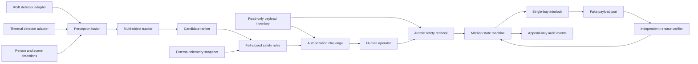

# Architecture

Multi-Detect is deliberately split into evidence, decision, authorization and simulated effect
layers. A component in an earlier layer cannot call a component in a later layer directly.

The same aircraft software supports two configurations derived from the desired mission payload list. With no
configured payload it runs `patrol_only`: confirmed tracks create deduplicated fire alerts and
return directly to search without an authorization or payload path. With one or more approved
payload slots it runs `deployment_capable` and retains the full safety, authorization and simulated
interlock sequence. Zero inventory in a patrol configuration is therefore normal; zero remaining
inventory in a deployment configuration requests return.

Desired configuration is not physical evidence. A separate read-only payload inventory provider must report a supported protocol version, module identity, controller/interlock health, exact slot IDs and types, locked state, and healthy presence sensors. A missing, stale, changed or mismatched report prevents authorization and revokes an existing challenge. Replay uses an explicitly labelled configured-simulation provider; live mode defaults to unavailable unless the operator explicitly enables the FakePayloadPort simulation cycle.

The referenced legacy YOLO code is behind an adapter. Its output is treated as an untrusted
candidate, never as an action. Tracking requires several observations over time. RGB/thermal
corroboration, platform telemetry and person exclusion are evaluated with deny-overrides
semantics: missing or stale evidence is a denial.

Authorization never freezes the safety view. While authorization is pending or the fake bay is
armed, each live frame is tracked and evaluated again. If the target remains spatially continuous
and every rule verdict stays safety-equivalent, the same challenge and operator grant are rebound to
the newest revision without extending their original expiry. A denial, target break or material
scene change invalidates the challenge and relocks the bay. A timer tick independently expires
unanswered challenges. The replay controller also keeps a scene-local served-region cooldown so a
rebuilt tracker ID cannot immediately receive another payload; a field system must replace that
image-space heuristic with persistent geospatial target identity.

## MVP boundary

The repository contains no live autopilot command, actuator, GPIO, serial release or MAVLink
release path. It can consume MAVLink telemetry read-only and it can process local/RTSP camera
frames, but the only payload endpoint remains an in-memory fake used for deterministic replay and
fault injection. Replacing that port requires a separate hazard analysis, authenticated protocol,
independent hardware interlocks, SIL/HIL validation and operational approval.

## Candidate ranking

Ranking is advisory. It may order eligible tracks by duration, confidence, observed area growth
and externally supplied risk features, but it cannot authorize or create a release transaction.
Personnel proximity may increase response priority while simultaneously denying deployment in
the exclusion zone.
